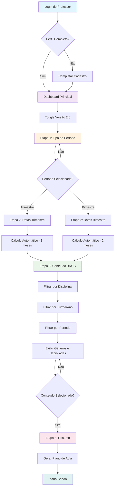
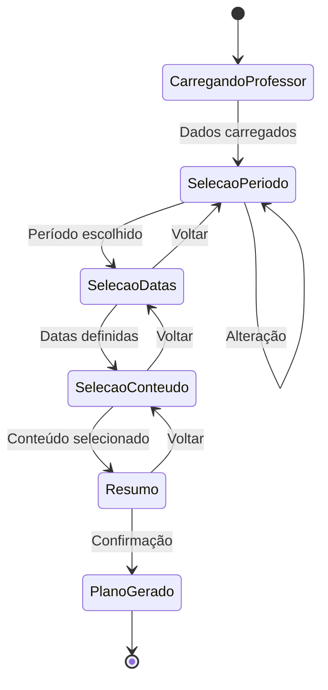

# Análise Completa do Fluxo - Sistema de Criação de Planos de Aula V2.0

## 1. Visão Geral do Sistema

O sistema de criação de planos de aula versão 2.0 é um fluxo estruturado que guia o professor através de 4 etapas principais para criar um plano de aula personalizado baseado no contexto educacional e nas diretrizes da BNCC.

### Objetivo Principal

Permitir que professores criem planos de aula de forma intuitiva, considerando:

* Período letivo (trimestre/bimestre)

* Datas específicas do período

* Conteúdo BNCC adequado ao contexto

* Informações do professor (disciplinas, turmas, escola)

## 2. Contexto do Professor

### 2.1 Informações Essenciais do Professor

O sistema precisa conhecer as seguintes informações sobre o professor logado:

| Informação           | Descrição                          | Uso no Sistema                    |
| -------------------- | ---------------------------------- | --------------------------------- |
| **Disciplinas**      | Quais matérias o professor leciona | Filtrar conteúdo BNCC relevante   |
| **Escolas**          | Em quantas/quais escolas trabalha  | Contexto organizacional           |
| **Turmas**           | Séries e turmas que leciona        | Adequar nível de habilidades BNCC |
| **Alunos por Turma** | Quantidade de estudantes           | Planejamento de atividades        |
| **Ano Letivo**       | Período atual de trabalho          | Calcular trimestres/bimestres     |
| **Região/Estado**    | Localização da escola              | Adequar calendário escolar        |

### 2.2 Como o Contexto Influencia Cada Etapa

**Etapa 1 - Seleção de Período:**

* O sistema usa o ano letivo atual do professor

* Considera o calendário escolar da região

**Etapa 2 - Seleção de Datas:**

* Calcula automaticamente as datas baseado no período escolhido

* Considera feriados e calendário da escola do professor

**Etapa 3 - Seleção de Conteúdo:**

* Filtra habilidades BNCC pela disciplina do professor

* Adequa o nível de complexidade às turmas que leciona

* Sugere conteúdo baseado no período selecionado

## 3. Fluxo Detalhado das Telas

### 3.1 Acesso ao Sistema V2.0

**Ponto de Entrada:**

* Professor acessa através do toggle "Versão 2.0" na interface principal

* Sistema verifica se o professor tem perfil completo

* Redireciona para `/criar-plano-aula-v2`

### 3.2 Etapa 1: Seleção do Tipo de Período

**Tela:** Seleção Trimestre/Bimestre

**Elementos da Interface:**

* Breadcrumb: "Tipo de Período" (ativo)

* Título: "Para qual período deseja criar o plano?"

* Opções: Trimestre | Bimestre

* Botões: Voltar | Continuar (desabilitado até seleção)

**Lógica de Negócio:**

```javascript
// Estado da aplicação
const [periodoSelecionado, setPeriodoSelecionado] = useState('')
const [etapaAtual, setEtapaAtual] = useState('selecao_periodo')

// Função de seleção
const handlePeriodoSelection = (tipo) => {
  setPeriodoSelecionado(tipo)
  // Habilita botão continuar
}
```

**Validações:**

* Usuário deve selecionar um período para prosseguir

* Sistema valida se professor tem turmas ativas no ano letivo

### 3.3 Etapa 2: Seleção de Datas

**Tela:** Definição do Período Específico

**Elementos da Interface:**

* Breadcrumb: "Tipo de Período" → "Datas" (ativo)

* Título: "Selecione as datas do \[trimestre/bimestre]"

* Calendário interativo

* Campos: Data Início | Data Fim

* Botões: Voltar | Continuar

**Lógica de Cálculo de Datas:**

```javascript
// Cálculo automático baseado no período
const calcularPeriodo = (tipo, anoLetivo) => {
  if (tipo === 'trimestre') {
    // Divide ano letivo em 3 períodos de ~3 meses
    return {
      '1º trimestre': { inicio: '01/02', fim: '30/04' },
      '2º trimestre': { inicio: '01/05', fim: '31/07' },
      '3º trimestre': { inicio: '01/08', fim: '30/11' }
    }
  }
  // Lógica similar para bimestre
}
```

**Integração com Banco de Dados:**

* Consulta calendário escolar da escola do professor

* Considera feriados regionais

* Valida se período não conflita com férias

### 3.4 Etapa 3: Seleção de Conteúdo BNCC

**Tela:** Seleção de Gêneros e Habilidades

**Elementos da Interface:**

* Breadcrumb: "Tipo de Período" → "Datas" → "Conteúdo" (ativo)

* Título: "Seleção de Conteúdo"

* Subtítulo: "Sugestões baseadas no \[período selecionado]"

* Abas de Gêneros: Conto | Poema | Fábula | Notícia | Carta | Relato

* Cards de Habilidades BNCC

* Painel lateral: "Itens Selecionados"

* Footer fixo: Contador + Botões navegação

**Estrutura de Dados BNCC:**

```javascript
// Estrutura das habilidades no banco
const habilidadeBNCC = {
  codigo: 'EF03LP01',
  descricao: 'Ler e compreender, com autonomia, textos injuntivos...',
  ano: '3º ano',
  disciplina: 'Língua Portuguesa',
  genero: 'Conto',
  periodo_sugerido: '1º trimestre',
  complexidade: 'básica'
}
```

**Lógica de Filtragem:**

```javascript
// Filtros aplicados automaticamente
const filtrarHabilidades = (professor, periodo) => {
  return habilidades.filter(h => 
    h.disciplina === professor.disciplina &&
    h.ano.includes(professor.turmas) &&
    h.periodo_sugerido === periodo
  )
}
```

### 3.5 Etapa 4: Resumo e Confirmação

**Tela:** Revisão Final

**Elementos da Interface:**

* Breadcrumb: Todas etapas → "Resumo/Confirmação" (ativo)

* Resumo das seleções anteriores

* Preview do plano de aula

* Botões: Voltar | Gerar Plano

## 4. Wireframe do Fluxo Completo



## 5. Fluxo de Dados e Estados



## 6. Integração com Banco de Dados

### 6.1 Tabelas Principais

```sql
-- Tabela de Professores
CREATE TABLE professores (
    id UUID PRIMARY KEY,
    nome VARCHAR(255),
    email VARCHAR(255),
    disciplinas TEXT[], -- Array de disciplinas
    escolas UUID[], -- Array de IDs das escolas
    ano_letivo INTEGER
);

-- Tabela de Turmas do Professor
CREATE TABLE professor_turmas (
    id UUID PRIMARY KEY,
    professor_id UUID REFERENCES professores(id),
    serie VARCHAR(10), -- '3º ano', '4º ano', etc.
    turma VARCHAR(10), -- 'A', 'B', 'C'
    quantidade_alunos INTEGER,
    escola_id UUID
);

-- Tabela de Habilidades BNCC
CREATE TABLE habilidades_bncc (
    id UUID PRIMARY KEY,
    codigo VARCHAR(20), -- EF03LP01
    descricao TEXT,
    disciplina VARCHAR(100),
    ano_serie VARCHAR(20),
    genero_textual VARCHAR(100),
    periodo_sugerido VARCHAR(20), -- '1º trimestre'
    complexidade VARCHAR(20) -- 'básica', 'intermediária', 'avançada'
);

-- Tabela de Planos Criados
CREATE TABLE planos_aula (
    id UUID PRIMARY KEY,
    professor_id UUID REFERENCES professores(id),
    tipo_periodo VARCHAR(20), -- 'trimestre' ou 'bimestre'
    data_inicio DATE,
    data_fim DATE,
    habilidades_selecionadas UUID[], -- Array de IDs das habilidades
    generos_selecionados TEXT[],
    created_at TIMESTAMP DEFAULT NOW()
);
```

### 6.2 Consultas Principais

```sql
-- Buscar habilidades para o professor
SELECT h.* 
FROM habilidades_bncc h
JOIN professor_turmas pt ON h.ano_serie = pt.serie
WHERE pt.professor_id = $1 
  AND h.disciplina = ANY($2) -- disciplinas do professor
  AND h.periodo_sugerido = $3; -- período selecionado

-- Calcular datas do período
SELECT 
  CASE 
    WHEN $1 = 'trimestre' THEN 
      CASE $2 
        WHEN 1 THEN DATE('2024-02-01')
        WHEN 2 THEN DATE('2024-05-01')
        WHEN 3 THEN DATE('2024-08-01')
      END
  END as data_inicio;
```

## 7. Validações e Regras de Negócio

### 7.1 Validações por Etapa

**Etapa 1 - Seleção de Período:**

* ✅ Professor deve ter turmas ativas

* ✅ Ano letivo deve estar configurado

* ✅ Deve selecionar trimestre OU bimestre

**Etapa 2 - Seleção de Datas:**

* ✅ Data início deve ser anterior à data fim

* ✅ Período deve ter duração mínima (30 dias)

* ✅ Não pode conflitar com férias escolares

* ✅ Deve estar dentro do ano letivo

**Etapa 3 - Seleção de Conteúdo:**

* ✅ Deve selecionar pelo menos 1 gênero

* ✅ Deve selecionar pelo menos 2 habilidades

* ✅ Habilidades devem ser compatíveis com as turmas do professor

### 7.2 Regras de Sugestão de Conteúdo

1. **Por Período:**

   * 1º Trimestre: Gêneros narrativos (Conto, Fábula)

   * 2º Trimestre: Gêneros informativos (Notícia, Relato)

   * 3º Trimestre: Gêneros expressivos (Poema, Carta)

2. **Por Série:**

   * 1º-2º ano: Habilidades básicas de leitura

   * 3º-4º ano: Compreensão e interpretação

   * 5º ano: Produção textual avançada

3. **Por Complexidade:**

   * Início do ano: Habilidades básicas

   * Meio do ano: Habilidades intermediárias

   * Final do ano: Habilidades avançadas

## 8. Estados da Aplicação

### 8.1 Estado Global

```javascript
const estadoGlobal = {
  // Dados do professor
  professor: {
    id: 'uuid',
    nome: 'string',
    disciplinas: ['Língua Portuguesa'],
    turmas: [{ serie: '3º ano', turma: 'A' }],
    escola: 'uuid'
  },
  
  // Fluxo atual
  etapaAtual: 'selecao_periodo', // selecao_periodo | selecao_datas | selecao_conteudo | resumo
  
  // Seleções do usuário
  periodoSelecionado: '', // 'trimestre' | 'bimestre'
  dataInicio: null,
  dataFim: null,
  generosSelecionados: [],
  habilidadesSelecionadas: [],
  
  // Dados carregados
  habilidadesDisponiveis: [],
  generosDisponiveis: [],
  
  // Estados de loading
  carregandoHabilidades: false,
  salvandoPlano: false
}
```

### 8.2 Funções de Navegação

```javascript
// Navegação entre etapas
const navegarPara = (etapa) => {
  // Validar etapa atual antes de navegar
  if (validarEtapaAtual()) {
    setEtapaAtual(etapa)
  }
}

// Validações por etapa
const validarEtapaAtual = () => {
  switch (etapaAtual) {
    case 'selecao_periodo':
      return periodoSelecionado !== ''
    case 'selecao_datas':
      return dataInicio && dataFim
    case 'selecao_conteudo':
      return generosSelecionados.length > 0 && habilidadesSelecionadas.length > 1
    default:
      return true
  }
}
```

## 9. Próximos Passos

### 9.1 Implementações Necessárias

1. **Integração com Banco de Dados:**

   * [ ] Criar/atualizar tabelas de habilidades BNCC

   * [ ] Implementar consultas de filtragem

   * [ ] Configurar relacionamentos professor-turma-escola

2. **Funcionalidades Pendentes:**

   * [ ] Cálculo automático de datas por período

   * [ ] Carregamento dinâmico de habilidades BNCC

   * [ ] Sistema de sugestões inteligentes

   * [ ] Validações de negócio em tempo real

3. **Melhorias de UX:**

   * [ ] Loading states em todas as etapas

   * [ ] Mensagens de erro contextuais

   * [ ] Salvamento automático do progresso

   * [ ] Breadcrumb interativo

### 9.2 Considerações Técnicas

* **Performance:** Implementar cache para habilidades BNCC

* **Acessibilidade:** Garantir navegação por teclado

* **Responsividade:** Otimizar para dispositivos móveis

* **SEO:** Implementar meta tags apropriadas

***

*Este documento serve como guia completo para implementação e manutenção do sistema de criação de planos de aula versão 2.0, garantindo que todas as funcionalidades estejam alinhadas com as necessidades pedagógicas e técnicas do projeto.*
