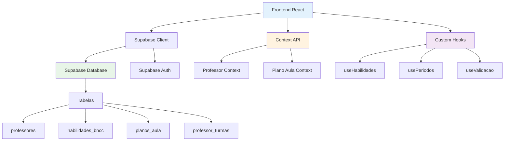
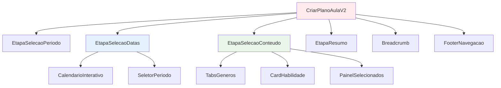

# Arquitetura Técnica - Sistema de Planos de Aula V2.0

## 1. Arquitetura Geral do Sistema



## 2. Estrutura de Componentes

### 2.1 Hierarquia de Componentes



### 2.2 Props e Estados dos Componentes

```typescript
// Tipos principais
interface Professor {
  id: string
  nome: string
  email: string
  disciplinas: string[]
  turmas: Turma[]
  escola_id: string
}

interface Turma {
  id: string
  serie: string // '3º ano'
  turma: string // 'A'
  quantidade_alunos: number
}

interface HabilidadeBNCC {
  id: string
  codigo: string // 'EF03LP01'
  descricao: string
  disciplina: string
  ano_serie: string
  genero_textual: string
  periodo_sugerido: string
  complexidade: 'básica' | 'intermediária' | 'avançada'
}

interface EstadoPlanoAula {
  etapaAtual: 'selecao_periodo' | 'selecao_datas' | 'selecao_conteudo' | 'resumo'
  periodoSelecionado: 'trimestre' | 'bimestre' | ''
  dataInicio: Date | null
  dataFim: Date | null
  generosSelecionados: string[]
  habilidadesSelecionadas: string[]
}
```

## 3. Implementação dos Custom Hooks

### 3.1 useHabilidades Hook

```typescript
// hooks/useHabilidades.ts
import { useState, useEffect } from 'react'
import { supabase } from '../lib/supabase'

export const useHabilidades = (professor: Professor, periodo: string) => {
  const [habilidades, setHabilidades] = useState<HabilidadeBNCC[]>([])
  const [loading, setLoading] = useState(false)
  const [error, setError] = useState<string | null>(null)

  useEffect(() => {
    if (!professor.id || !periodo) return

    const carregarHabilidades = async () => {
      setLoading(true)
      setError(null)

      try {
        // Buscar séries das turmas do professor
        const series = professor.turmas.map(t => t.serie)
        
        const { data, error } = await supabase
          .from('habilidades_bncc')
          .select('*')
          .in('disciplina', professor.disciplinas)
          .in('ano_serie', series)
          .eq('periodo_sugerido', periodo)
          .order('codigo')

        if (error) throw error
        setHabilidades(data || [])
      } catch (err) {
        setError(err.message)
      } finally {
        setLoading(false)
      }
    }

    carregarHabilidades()
  }, [professor.id, periodo])

  return { habilidades, loading, error }
}
```

### 3.2 usePeriodos Hook

```typescript
// hooks/usePeriodos.ts
import { useMemo } from 'react'

export const usePeriodos = (tipo: 'trimestre' | 'bimestre', anoLetivo: number = 2024) => {
  const periodos = useMemo(() => {
    const inicioAno = new Date(anoLetivo, 1, 1) // 1º de fevereiro
    const fimAno = new Date(anoLetivo, 10, 30) // 30 de novembro
    
    if (tipo === 'trimestre') {
      return [
        {
          numero: 1,
          nome: '1º Trimestre',
          inicio: new Date(anoLetivo, 1, 1), // fevereiro
          fim: new Date(anoLetivo, 3, 30) // abril
        },
        {
          numero: 2,
          nome: '2º Trimestre', 
          inicio: new Date(anoLetivo, 4, 1), // maio
          fim: new Date(anoLetivo, 6, 31) // julho
        },
        {
          numero: 3,
          nome: '3º Trimestre',
          inicio: new Date(anoLetivo, 7, 1), // agosto
          fim: new Date(anoLetivo, 10, 30) // novembro
        }
      ]
    } else {
      return [
        {
          numero: 1,
          nome: '1º Bimestre',
          inicio: new Date(anoLetivo, 1, 1),
          fim: new Date(anoLetivo, 2, 31)
        },
        {
          numero: 2,
          nome: '2º Bimestre',
          inicio: new Date(anoLetivo, 3, 1),
          fim: new Date(anoLetivo, 4, 30)
        },
        {
          numero: 3,
          nome: '3º Bimestre',
          inicio: new Date(anoLetivo, 5, 1),
          fim: new Date(anoLetivo, 6, 31)
        },
        {
          numero: 4,
          nome: '4º Bimestre',
          inicio: new Date(anoLetivo, 7, 1),
          fim: new Date(anoLetivo, 10, 30)
        }
      ]
    }
  }, [tipo, anoLetivo])

  return periodos
}
```

### 3.3 useValidacao Hook

```typescript
// hooks/useValidacao.ts
import { useMemo } from 'react'

export const useValidacao = (estado: EstadoPlanoAula) => {
  const validacoes = useMemo(() => {
    return {
      selecao_periodo: {
        valido: estado.periodoSelecionado !== '',
        mensagem: estado.periodoSelecionado === '' ? 'Selecione um tipo de período' : ''
      },
      selecao_datas: {
        valido: estado.dataInicio && estado.dataFim && estado.dataInicio < estado.dataFim,
        mensagem: !estado.dataInicio || !estado.dataFim 
          ? 'Selecione as datas de início e fim'
          : estado.dataInicio >= estado.dataFim 
          ? 'Data de início deve ser anterior à data de fim'
          : ''
      },
      selecao_conteudo: {
        valido: estado.generosSelecionados.length > 0 && estado.habilidadesSelecionadas.length >= 2,
        mensagem: estado.generosSelecionados.length === 0
          ? 'Selecione pelo menos um gênero textual'
          : estado.habilidadesSelecionadas.length < 2
          ? 'Selecione pelo menos duas habilidades'
          : ''
      }
    }
  }, [estado])

  const podeAvancar = (etapa: string) => {
    return validacoes[etapa]?.valido || false
  }

  const obterMensagemErro = (etapa: string) => {
    return validacoes[etapa]?.mensagem || ''
  }

  return { podeAvancar, obterMensagemErro, validacoes }
}
```

## 4. Context API - Gerenciamento de Estado

### 4.1 PlanoAulaContext

```typescript
// context/PlanoAulaContext.tsx
import React, { createContext, useContext, useReducer } from 'react'

interface PlanoAulaState {
  etapaAtual: string
  periodoSelecionado: string
  dataInicio: Date | null
  dataFim: Date | null
  generosSelecionados: string[]
  habilidadesSelecionadas: string[]
  habilidadesDisponiveis: HabilidadeBNCC[]
  loading: boolean
}

type PlanoAulaAction = 
  | { type: 'SET_ETAPA'; payload: string }
  | { type: 'SET_PERIODO'; payload: string }
  | { type: 'SET_DATAS'; payload: { inicio: Date; fim: Date } }
  | { type: 'TOGGLE_GENERO'; payload: string }
  | { type: 'TOGGLE_HABILIDADE'; payload: string }
  | { type: 'SET_HABILIDADES_DISPONIVEIS'; payload: HabilidadeBNCC[] }
  | { type: 'SET_LOADING'; payload: boolean }

const planoAulaReducer = (state: PlanoAulaState, action: PlanoAulaAction): PlanoAulaState => {
  switch (action.type) {
    case 'SET_ETAPA':
      return { ...state, etapaAtual: action.payload }
    
    case 'SET_PERIODO':
      return { ...state, periodoSelecionado: action.payload }
    
    case 'SET_DATAS':
      return { 
        ...state, 
        dataInicio: action.payload.inicio,
        dataFim: action.payload.fim 
      }
    
    case 'TOGGLE_GENERO':
      const generos = state.generosSelecionados.includes(action.payload)
        ? state.generosSelecionados.filter(g => g !== action.payload)
        : [...state.generosSelecionados, action.payload]
      return { ...state, generosSelecionados: generos }
    
    case 'TOGGLE_HABILIDADE':
      const habilidades = state.habilidadesSelecionadas.includes(action.payload)
        ? state.habilidadesSelecionadas.filter(h => h !== action.payload)
        : [...state.habilidadesSelecionadas, action.payload]
      return { ...state, habilidadesSelecionadas: habilidades }
    
    case 'SET_HABILIDADES_DISPONIVEIS':
      return { ...state, habilidadesDisponiveis: action.payload }
    
    case 'SET_LOADING':
      return { ...state, loading: action.payload }
    
    default:
      return state
  }
}

const PlanoAulaContext = createContext<{
  state: PlanoAulaState
  dispatch: React.Dispatch<PlanoAulaAction>
} | null>(null)

export const PlanoAulaProvider: React.FC<{ children: React.ReactNode }> = ({ children }) => {
  const [state, dispatch] = useReducer(planoAulaReducer, {
    etapaAtual: 'selecao_periodo',
    periodoSelecionado: '',
    dataInicio: null,
    dataFim: null,
    generosSelecionados: [],
    habilidadesSelecionadas: [],
    habilidadesDisponiveis: [],
    loading: false
  })

  return (
    <PlanoAulaContext.Provider value={{ state, dispatch }}>
      {children}
    </PlanoAulaContext.Provider>
  )
}

export const usePlanoAula = () => {
  const context = useContext(PlanoAulaContext)
  if (!context) {
    throw new Error('usePlanoAula deve ser usado dentro de PlanoAulaProvider')
  }
  return context
}
```

## 5. Serviços de Integração com Supabase

### 5.1 HabilidadesService

```typescript
// services/HabilidadesService.ts
import { supabase } from '../lib/supabase'

export class HabilidadesService {
  static async buscarPorProfessor(professorId: string, periodo: string) {
    try {
      // Primeiro, buscar as turmas do professor
      const { data: turmas, error: turmasError } = await supabase
        .from('professor_turmas')
        .select('serie')
        .eq('professor_id', professorId)

      if (turmasError) throw turmasError

      // Buscar disciplinas do professor
      const { data: professor, error: professorError } = await supabase
        .from('professores')
        .select('disciplinas')
        .eq('id', professorId)
        .single()

      if (professorError) throw professorError

      // Buscar habilidades filtradas
      const series = turmas?.map(t => t.serie) || []
      const { data: habilidades, error: habilidadesError } = await supabase
        .from('habilidades_bncc')
        .select('*')
        .in('disciplina', professor.disciplinas)
        .in('ano_serie', series)
        .eq('periodo_sugerido', periodo)
        .order('genero_textual, codigo')

      if (habilidadesError) throw habilidadesError

      return habilidades
    } catch (error) {
      console.error('Erro ao buscar habilidades:', error)
      throw error
    }
  }

  static async buscarGeneros(professorId: string) {
    try {
      const { data, error } = await supabase
        .from('habilidades_bncc')
        .select('genero_textual')
        .not('genero_textual', 'is', null)

      if (error) throw error

      // Remover duplicatas
      const generosUnicos = [...new Set(data?.map(h => h.genero_textual))]
      return generosUnicos
    } catch (error) {
      console.error('Erro ao buscar gêneros:', error)
      throw error
    }
  }
}
```

### 5.2 PlanoAulaService

```typescript
// services/PlanoAulaService.ts
import { supabase } from '../lib/supabase'

export class PlanoAulaService {
  static async salvar(plano: {
    professor_id: string
    tipo_periodo: string
    data_inicio: Date
    data_fim: Date
    habilidades_selecionadas: string[]
    generos_selecionados: string[]
  }) {
    try {
      const { data, error } = await supabase
        .from('planos_aula')
        .insert(plano)
        .select()
        .single()

      if (error) throw error
      return data
    } catch (error) {
      console.error('Erro ao salvar plano:', error)
      throw error
    }
  }

  static async buscarPorProfessor(professorId: string) {
    try {
      const { data, error } = await supabase
        .from('planos_aula')
        .select(`
          *,
          habilidades:habilidades_selecionadas(
            codigo,
            descricao,
            genero_textual
          )
        `)
        .eq('professor_id', professorId)
        .order('created_at', { ascending: false })

      if (error) throw error
      return data
    } catch (error) {
      console.error('Erro ao buscar planos:', error)
      throw error
    }
  }
}
```

## 6. Estrutura de Banco de Dados Detalhada

### 6.1 Schema Completo

```sql
-- Extensões necessárias
CREATE EXTENSION IF NOT EXISTS "uuid-ossp";

-- Tabela de Escolas
CREATE TABLE escolas (
    id UUID PRIMARY KEY DEFAULT uuid_generate_v4(),
    nome VARCHAR(255) NOT NULL,
    codigo_inep VARCHAR(20),
    endereco TEXT,
    cidade VARCHAR(100),
    estado VARCHAR(2),
    tipo VARCHAR(50), -- 'municipal', 'estadual', 'federal', 'privada'
    created_at TIMESTAMP WITH TIME ZONE DEFAULT NOW()
);

-- Tabela de Professores
CREATE TABLE professores (
    id UUID PRIMARY KEY DEFAULT uuid_generate_v4(),
    user_id UUID REFERENCES auth.users(id) ON DELETE CASCADE,
    nome VARCHAR(255) NOT NULL,
    email VARCHAR(255) UNIQUE NOT NULL,
    cpf VARCHAR(14),
    telefone VARCHAR(20),
    disciplinas TEXT[] NOT NULL DEFAULT '{}',
    ano_letivo INTEGER DEFAULT EXTRACT(YEAR FROM NOW()),
    ativo BOOLEAN DEFAULT true,
    created_at TIMESTAMP WITH TIME ZONE DEFAULT NOW(),
    updated_at TIMESTAMP WITH TIME ZONE DEFAULT NOW()
);

-- Tabela de relacionamento Professor-Escola
CREATE TABLE professor_escolas (
    id UUID PRIMARY KEY DEFAULT uuid_generate_v4(),
    professor_id UUID REFERENCES professores(id) ON DELETE CASCADE,
    escola_id UUID REFERENCES escolas(id) ON DELETE CASCADE,
    cargo VARCHAR(100), -- 'professor', 'coordenador', 'diretor'
    carga_horaria INTEGER,
    ativo BOOLEAN DEFAULT true,
    created_at TIMESTAMP WITH TIME ZONE DEFAULT NOW(),
    UNIQUE(professor_id, escola_id)
);

-- Tabela de Turmas
CREATE TABLE turmas (
    id UUID PRIMARY KEY DEFAULT uuid_generate_v4(),
    escola_id UUID REFERENCES escolas(id) ON DELETE CASCADE,
    nome VARCHAR(50) NOT NULL, -- '3º Ano A'
    serie VARCHAR(20) NOT NULL, -- '3º ano'
    turma VARCHAR(10) NOT NULL, -- 'A'
    ano_letivo INTEGER NOT NULL,
    turno VARCHAR(20), -- 'matutino', 'vespertino', 'noturno'
    quantidade_alunos INTEGER DEFAULT 0,
    ativo BOOLEAN DEFAULT true,
    created_at TIMESTAMP WITH TIME ZONE DEFAULT NOW()
);

-- Tabela de relacionamento Professor-Turma
CREATE TABLE professor_turmas (
    id UUID PRIMARY KEY DEFAULT uuid_generate_v4(),
    professor_id UUID REFERENCES professores(id) ON DELETE CASCADE,
    turma_id UUID REFERENCES turmas(id) ON DELETE CASCADE,
    disciplina VARCHAR(100) NOT NULL,
    carga_horaria_semanal INTEGER,
    ativo BOOLEAN DEFAULT true,
    created_at TIMESTAMP WITH TIME ZONE DEFAULT NOW(),
    UNIQUE(professor_id, turma_id, disciplina)
);

-- Tabela de Habilidades BNCC
CREATE TABLE habilidades_bncc (
    id UUID PRIMARY KEY DEFAULT uuid_generate_v4(),
    codigo VARCHAR(20) UNIQUE NOT NULL, -- 'EF03LP01'
    descricao TEXT NOT NULL,
    disciplina VARCHAR(100) NOT NULL,
    componente VARCHAR(100), -- 'Língua Portuguesa', 'Matemática', etc.
    ano_serie VARCHAR(20) NOT NULL, -- '3º ano'
    unidade_tematica VARCHAR(200),
    objeto_conhecimento VARCHAR(300),
    genero_textual VARCHAR(100),
    periodo_sugerido VARCHAR(20), -- '1º trimestre', '2º bimestre'
    complexidade VARCHAR(20) DEFAULT 'básica', -- 'básica', 'intermediária', 'avançada'
    ativo BOOLEAN DEFAULT true,
    created_at TIMESTAMP WITH TIME ZONE DEFAULT NOW()
);

-- Tabela de Planos de Aula
CREATE TABLE planos_aula (
    id UUID PRIMARY KEY DEFAULT uuid_generate_v4(),
    professor_id UUID REFERENCES professores(id) ON DELETE CASCADE,
    turma_id UUID REFERENCES turmas(id),
    titulo VARCHAR(255),
    tipo_periodo VARCHAR(20) NOT NULL, -- 'trimestre', 'bimestre'
    numero_periodo INTEGER, -- 1, 2, 3, 4
    data_inicio DATE NOT NULL,
    data_fim DATE NOT NULL,
    habilidades_selecionadas UUID[] NOT NULL DEFAULT '{}',
    generos_selecionados TEXT[] NOT NULL DEFAULT '{}',
    objetivos TEXT[],
    metodologia TEXT,
    recursos TEXT[],
    avaliacao TEXT,
    observacoes TEXT,
    status VARCHAR(20) DEFAULT 'rascunho', -- 'rascunho', 'finalizado', 'aplicado'
    created_at TIMESTAMP WITH TIME ZONE DEFAULT NOW(),
    updated_at TIMESTAMP WITH TIME ZONE DEFAULT NOW()
);

-- Índices para performance
CREATE INDEX idx_professores_user_id ON professores(user_id);
CREATE INDEX idx_professores_email ON professores(email);
CREATE INDEX idx_professor_turmas_professor_id ON professor_turmas(professor_id);
CREATE INDEX idx_professor_turmas_turma_id ON professor_turmas(turma_id);
CREATE INDEX idx_habilidades_bncc_disciplina ON habilidades_bncc(disciplina);
CREATE INDEX idx_habilidades_bncc_ano_serie ON habilidades_bncc(ano_serie);
CREATE INDEX idx_habilidades_bncc_periodo ON habilidades_bncc(periodo_sugerido);
CREATE INDEX idx_planos_aula_professor_id ON planos_aula(professor_id);
CREATE INDEX idx_planos_aula_data_inicio ON planos_aula(data_inicio);
```

### 6.2 Políticas de Segurança (RLS)

```sql
-- Habilitar RLS nas tabelas
ALTER TABLE professores ENABLE ROW LEVEL SECURITY;
ALTER TABLE professor_turmas ENABLE ROW LEVEL SECURITY;
ALTER TABLE planos_aula ENABLE ROW LEVEL SECURITY;

-- Políticas para professores
CREATE POLICY "Professores podem ver seus próprios dados" ON professores
    FOR ALL USING (auth.uid() = user_id);

-- Políticas para professor_turmas
CREATE POLICY "Professores podem ver suas turmas" ON professor_turmas
    FOR ALL USING (
        professor_id IN (
            SELECT id FROM professores WHERE user_id = auth.uid()
        )
    );

-- Políticas para planos_aula
CREATE POLICY "Professores podem gerenciar seus planos" ON planos_aula
    FOR ALL USING (
        professor_id IN (
            SELECT id FROM professores WHERE user_id = auth.uid()
        )
    );

-- Habilidades BNCC são públicas para leitura
CREATE POLICY "Habilidades BNCC são públicas" ON habilidades_bncc
    FOR SELECT USING (true);
```

## 7. Testes e Validação

### 7.1 Testes Unitários

```typescript
// __tests__/hooks/useHabilidades.test.ts
import { renderHook, waitFor } from '@testing-library/react'
import { useHabilidades } from '../../hooks/useHabilidades'

const mockProfessor = {
  id: '123',
  disciplinas: ['Língua Portuguesa'],
  turmas: [{ serie: '3º ano', turma: 'A' }]
}

describe('useHabilidades', () => {
  it('deve carregar habilidades para o professor', async () => {
    const { result } = renderHook(() => 
      useHabilidades(mockProfessor, '1º trimestre')
    )

    expect(result.current.loading).toBe(true)

    await waitFor(() => {
      expect(result.current.loading).toBe(false)
      expect(result.current.habilidades).toHaveLength(2)
    })
  })

  it('deve filtrar habilidades por período', async () => {
    const { result } = renderHook(() => 
      useHabilidades(mockProfessor, '2º trimestre')
    )

    await waitFor(() => {
      expect(result.current.habilidades.every(
        h => h.periodo_sugerido === '2º trimestre'
      )).toBe(true)
    })
  })
})
```

### 7.2 Testes de Integração

```typescript
// __tests__/integration/fluxo-completo.test.ts
import { render, screen, fireEvent, waitFor } from '@testing-library/react'
import { CriarPlanoAulaV2 } from '../../pages/CriarPlanoAulaV2'

describe('Fluxo Completo - Criar Plano Aula V2', () => {
  it('deve completar o fluxo de criação de plano', async () => {
    render(<CriarPlanoAulaV2 />)

    // Etapa 1: Selecionar período
    fireEvent.click(screen.getByText('Trimestre'))
    fireEvent.click(screen.getByText('Continuar'))

    // Etapa 2: Selecionar datas
    await waitFor(() => {
      expect(screen.getByText('Selecione as datas')).toBeInTheDocument()
    })
    
    // Simular seleção de datas
    fireEvent.click(screen.getByText('Continuar'))

    // Etapa 3: Selecionar conteúdo
    await waitFor(() => {
      expect(screen.getByText('Seleção de Conteúdo')).toBeInTheDocument()
    })

    // Selecionar gênero e habilidades
    fireEvent.click(screen.getByText('Conto'))
    fireEvent.click(screen.getByText('(EF03LP01)'))
    fireEvent.click(screen.getByText('(EF03LP02)'))
    fireEvent.click(screen.getByText('Próximo'))

    // Etapa 4: Resumo
    await waitFor(() => {
      expect(screen.getByText('Resumo')).toBeInTheDocument()
    })
  })
})
```

## 8. Performance e Otimizações

### 8.1 Estratégias de Cache

```typescript
// utils/cache.ts
class CacheManager {
  private cache = new Map<string, { data: any; timestamp: number; ttl: number }>()

  set(key: string, data: any, ttl: number = 300000) { // 5 minutos default
    this.cache.set(key, {
      data,
      timestamp: Date.now(),
      ttl
    })
  }

  get(key: string) {
    const item = this.cache.get(key)
    if (!item) return null

    if (Date.now() - item.timestamp > item.ttl) {
      this.cache.delete(key)
      return null
    }

    return item.data
  }

  clear() {
    this.cache.clear()
  }
}

export const cacheManager = new CacheManager()

// Uso no hook
export const useHabilidadesComCache = (professor: Professor, periodo: string) => {
  const cacheKey = `habilidades_${professor.id}_${periodo}`
  
  const [habilidades, setHabilidades] = useState(() => {
    return cacheManager.get(cacheKey) || []
  })

  useEffect(() => {
    const cached = cacheManager.get(cacheKey)
    if (cached) {
      setHabilidades(cached)
      return
    }

    // Buscar do servidor e cachear
    HabilidadesService.buscarPorProfessor(professor.id, periodo)
      .then(data => {
        setHabilidades(data)
        cacheManager.set(cacheKey, data)
      })
  }, [professor.id, periodo])

  return { habilidades }
}
```

### 8.2 Lazy Loading de Componentes

```typescript
// Lazy loading das etapas
const EtapaSelecaoPeriodo = lazy(() => import('./components/EtapaSelecaoPeriodo'))
const EtapaSelecaoDatas = lazy(() => import('./components/EtapaSelecaoDatas'))
const EtapaSelecaoConteudo = lazy(() => import('./components/EtapaSelecaoConteudo'))
const EtapaResumo = lazy(() => import('./components/EtapaResumo'))

// No componente principal
const renderEtapa = () => {
  return (
    <Suspense fallback={<LoadingSpinner />}>
      {etapaAtual === 'selecao_periodo' && <EtapaSelecaoPeriodo />}
      {etapaAtual === 'selecao_datas' && <EtapaSelecaoDatas />}
      {etapaAtual === 'selecao_conteudo' && <EtapaSelecaoConteudo />}
      {etapaAtual === 'resumo' && <EtapaResumo />}
    </Suspense>
  )
}
```

## 9. Monitoramento e Logs

### 9.1 Sistema de Logs

```typescript
// utils/logger.ts
class Logger {
  private context: string

  constructor(context: string) {
    this.context = context
  }

  info(message: string, data?: any) {
    console.log(`[${this.context}] INFO: ${message}`, data)
  }

  error(message: string, error?: any) {
    console.error(`[${this.context}] ERROR: ${message}`, error)
    
    // Enviar para serviço de monitoramento
    if (process.env.NODE_ENV === 'production') {
      this.sendToMonitoring('error', message, error)
    }
  }

  warn(message: string, data?: any) {
    console.warn(`[${this.context}] WARN: ${message}`, data)
  }

  private sendToMonitoring(level: string, message: string, data?: any) {
    // Implementar integração com Sentry, LogRocket, etc.
  }
}

// Uso nos componentes
const logger = new Logger('CriarPlanoAulaV2')

export const CriarPlanoAulaV2 = () => {
  useEffect(() => {
    logger.info('Componente CriarPlanoAulaV2 montado')
    
    return () => {
      logger.info('Componente CriarPlanoAulaV2 desmontado')
    }
  }, [])

  const handleError = (error: Error) => {
    logger.error('Erro no fluxo de criação de plano', error)
  }
}
```

***

*Esta documentação técnica complementa a análise de fluxo, fornecendo todos os detalhes necessários para implementação, manutenção e evolução do sistema de criação de planos de aula versão 2.0.*
