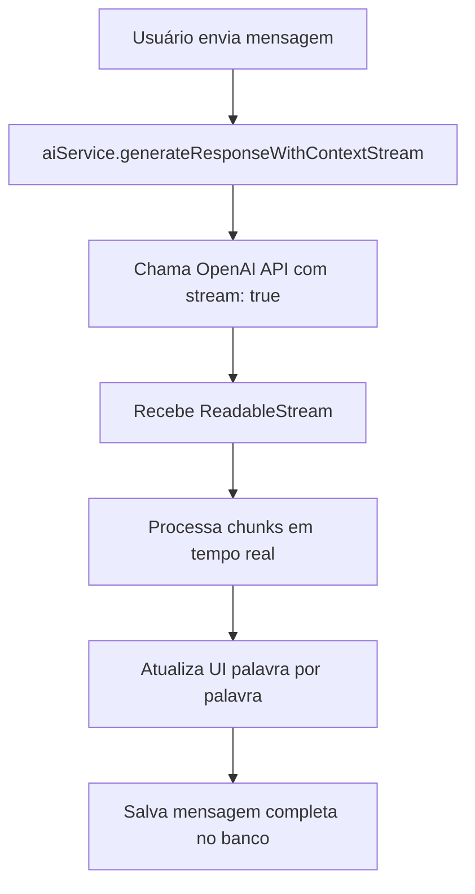

# 🚀 Guia do Streaming ChatGPT - Assistente Educacional

## 📋 **VISÃO GERAL**

O sistema agora suporta **streaming em tempo real** do ChatGPT, permitindo que as respostas apareçam sendo escritas palavra por palavra, ao invés de carregar tudo de uma vez.

### **🎯 Benefícios do Streaming:**
- ✅ **Experiência mais natural** - Texto aparece sendo escrito
- ✅ **Feedback imediato** - Usuário vê que a IA está respondendo
- ✅ **Melhor UX** - Reduz ansiedade de espera
- ✅ **Respostas longas** - Mais confortável para textos extensos

---

## 🔧 **COMO USAR**

### **1. Ativação do Streaming**

O streaming está **habilitado por padrão**. Para alternar:

1. **Acesse o chat** do assistente
2. **Role até o final** da página
3. **Clique no botão** `Streaming: ON/OFF`
4. **Azul = Ativado** | **Cinza = Desativado**

### **2. Indicadores Visuais**

#### **Durante o Streaming:**
- 🔵 **Cursor piscando** na mensagem sendo escrita
- 📝 **"Escrevendo..."** ao invés de "Digitando..."
- 🏷️ **Badge "STREAMING"** no indicador de status

#### **Controles:**
```
[Streaming: ON]  ← Clique para alternar
```

---

## 🛠️ **IMPLEMENTAÇÃO TÉCNICA**

### **1. Arquitetura**

```typescript
// Novo método no aiService
generateResponseWithContextStream(
  message: string,
  professorId: string,
  conversationHistory: Array<{...}>,
  config: AIServiceConfig
): Promise<AIStreamResponse>
```

### **2. Fluxo do Streaming**



### **3. Configuração da API OpenAI**

```typescript
// Parâmetros enviados para OpenAI
{
  model: 'gpt-4o-mini',
  messages: [...],
  temperature: 0.7,
  max_tokens: 2000,
  stream: true  // ← Habilita streaming
}
```

---

## 📊 **COMPARAÇÃO: STREAMING vs TRADICIONAL**

| Aspecto | Streaming | Tradicional |
|---------|-----------|-------------|
| **Velocidade percebida** | ⚡ Muito rápida | 🐌 Lenta |
| **Feedback visual** | ✅ Imediato | ❌ Só no final |
| **Experiência UX** | 🌟 Excelente | 📝 Básica |
| **Uso de recursos** | 📡 Mais conexão | 💾 Menos conexão |
| **Compatibilidade** | 🌐 Moderna | 🔧 Universal |

---

## 🎨 **RECURSOS VISUAIS**

### **1. Cursor Animado**
```css
/* Cursor piscando durante streaming */
.streaming-cursor {
  display: inline-block;
  width: 2px;
  height: 20px;
  background-color: #3b82f6;
  animation: pulse 1s infinite;
}
```

### **2. Indicadores de Status**
- 🔵 **Azul**: Streaming ativo
- ⚫ **Cinza**: Modo tradicional
- 📝 **"Escrevendo..."**: Durante streaming
- 💭 **"Digitando..."**: Modo tradicional

### **3. Badge de Streaming**
```jsx
{streamingEnabled && streamingMessageId && (
  <span className="text-xs text-blue-500 font-medium">
    STREAMING
  </span>
)}
```

---

## ⚙️ **CONFIGURAÇÕES AVANÇADAS**

### **1. Otimização + Streaming**

O streaming funciona **perfeitamente** com:
- ✅ **Otimização de contexto** (economy/balanced/quality)
- ✅ **Sistema de personas** personalizadas
- ✅ **Memória de conversas** anteriores
- ✅ **Monitoramento de tokens** em tempo real

### **2. Fallback Automático**

Se o streaming falhar:
```typescript
try {
  // Tenta streaming
  const streamResponse = await aiService.generateResponseWithContextStream(...)
} catch (error) {
  // Fallback para modo tradicional
  const response = await aiService.generateResponseWithContext(...)
}
```

---

## 🔍 **DEBUGGING E LOGS**

### **1. Logs do Console**

```javascript
// Início do streaming
🤖 Gerando resposta com streaming e contexto da conversa...

// Durante o processamento
📤 Enviando para OpenAI com streaming e contexto: {
  model: 'gpt-4o-mini',
  messagesCount: 5,
  stream: true
}

// Chunks recebidos
🔍 Chunk recebido: "Olá! Como posso"
🔍 Chunk recebido: " ajudar você hoje?"

// Finalização
✅ Streaming concluído no frontend
🏁 Streaming finalizado com [DONE]
```

### **2. Monitoramento de Erros**

```typescript
// Erros comuns e soluções
❌ Erro durante streaming: Network timeout
   → Solução: Verificar conexão de internet

❌ Resposta da API OpenAI não contém body
   → Solução: Verificar chave da API

❌ Linha ignorada no streaming: [invalid json]
   → Normal: Algumas linhas não são JSON válido
```

---

## 🚀 **PRÓXIMOS PASSOS**

### **Melhorias Planejadas:**
1. **Velocidade de digitação** configurável
2. **Pausa/retomar** streaming
3. **Streaming para planos de aula** e avaliações
4. **Indicador de progresso** visual
5. **Streaming em Edge Functions** do Supabase

### **Compatibilidade:**
- ✅ **Chrome/Edge** (100% suportado)
- ✅ **Firefox** (100% suportado)
- ✅ **Safari** (100% suportado)
- ✅ **Mobile** (iOS/Android)

---

## 📞 **SUPORTE**

### **Problemas Comuns:**

**Q: O streaming não funciona**
A: Verifique se a chave da OpenAI está configurada e se há conexão com internet.

**Q: Texto aparece muito rápido**
A: Normal! O streaming mostra conforme a IA gera. Velocidade varia por resposta.

**Q: Posso usar com personas?**
A: Sim! Streaming funciona com todas as personas e configurações.

**Q: Consome mais tokens?**
A: Não! O consumo é idêntico ao modo tradicional.

---

## 🎉 **CONCLUSÃO**

O **streaming do ChatGPT** transforma a experiência do assistente educacional, tornando as interações mais naturais e envolventes. 

**Ative agora** e experimente a diferença! 🚀

---

*Última atualização: Janeiro 2025*
*Versão: 1.0.0* 