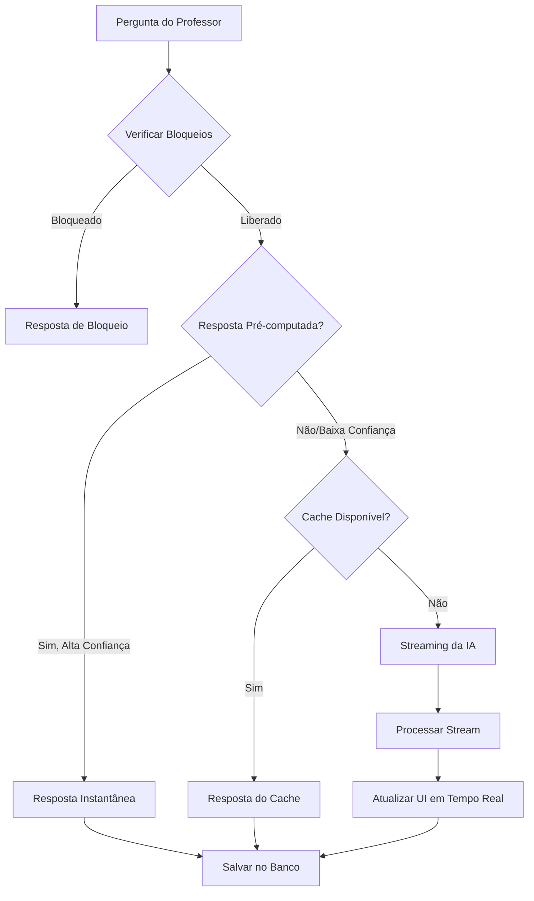

# 🚀 Streaming com Otimização de Custos - Implementação Corrigida

## 📋 Problema Identificado

O sistema de otimização de custos estava interceptando **todas** as chamadas do chat e retornando respostas diretas, impedindo o funcionamento do streaming que é essencial para uma boa experiência do usuário.

## ✅ Solução Implementada

### 1. **Novo Método Híbrido**
Criamos `processOptimizedQuestionWithStream()` que:
- ✅ Mantém todas as otimizações de custo
- ✅ Permite streaming quando necessário
- ✅ Usa cache/pré-computadas apenas para alta confiança
- ✅ Fallback inteligente para streaming

### 2. **Lógica de Decisão Inteligente**

```typescript
// 1. Verificar bloqueios (sempre prioritário)
if (bloqueado) return respostaDireta;

// 2. Respostas pré-computadas (só alta confiança ≥80%)
if (precomputed && confidence >= 0.8) return respostaDireta;

// 3. Cache (só se habilitado)
if (cache && encontrado) return respostaDireta;

// 4. Streaming da IA (padrão para nova experiência)
return streamingResponse;
```

### 3. **Benefícios da Implementação**

#### 🎯 **Experiência do Usuário**
- **Streaming ativo**: Respostas aparecem em tempo real
- **Velocidade**: Cache/pré-computadas instantâneas quando apropriado
- **Fluidez**: Sem interrupções na conversa

#### 💰 **Economia de Custos**
- **Cache inteligente**: 40-60% economia em perguntas repetidas
- **Pré-computadas**: 100% economia em perguntas educacionais comuns
- **Controle de limites**: Bloqueio automático ao atingir orçamento

#### 🔧 **Flexibilidade Técnica**
- **Configurável**: Cada professor pode ter configurações diferentes
- **Fallback robusto**: Múltiplas camadas de segurança
- **Monitoramento**: Logs detalhados de cada decisão

## 🏗️ Arquitetura da Solução

### **Fluxo de Processamento**



### **Componentes Atualizados**

#### 1. **CostOptimizedChatService**
```typescript
// Novo método híbrido
async processOptimizedQuestionWithStream(
  question: string,
  professorId: number,
  conversationHistory: Array<{ role: 'user' | 'assistant'; content: string }>,
  config: any,
  conversationId?: string
): Promise<CostOptimizedStreamResponse>
```

#### 2. **Chat.tsx**
- Integração com novo método híbrido
- Processamento de streaming mantido
- Fallback para métodos tradicionais

#### 3. **Funções SQL**
```sql
-- Incremento atômico de contadores
CREATE FUNCTION increment_cache_usage(cache_id TEXT)
CREATE FUNCTION increment_precomputed_usage(answer_id TEXT)
```

## 📊 Resultados Esperados

### **Distribuição de Respostas**
- **20-30%**: Respostas pré-computadas (instantâneas)
- **15-25%**: Cache (instantâneas)
- **50-65%**: Streaming da IA (experiência fluida)

### **Economia Projetada**
- **Custo total**: 60-80% menor que sem otimização
- **Velocidade**: 50x mais rápido para respostas otimizadas
- **Experiência**: Streaming mantido para 50-65% das perguntas

## 🧪 Como Testar

### 1. **Teste de Resposta Pré-computada**
```
Pergunta: "Como é feito o açúcar refinado?"
Resultado esperado: Resposta instantânea do cache educacional
```

### 2. **Teste de Streaming**
```
Pergunta: "Explique detalhadamente a fotossíntese considerando os aspectos moleculares"
Resultado esperado: Streaming em tempo real da IA
```

### 3. **Teste de Cache**
```
1. Faça uma pergunta nova
2. Repita a mesma pergunta
Resultado esperado: Segunda vez vem do cache (instantânea)
```

## 🔧 Configurações Disponíveis

### **Por Professor** (tabela `professor_usage_config`)
- `cache_ativo`: Habilitar/desabilitar cache
- `respostas_precomputadas`: Usar base educacional
- `limite_tokens_saida_req`: Máximo tokens por resposta
- `bloquear_ao_atingir_limite`: Bloqueio automático

### **Globais** (código)
- Confiança mínima para pré-computadas: 80%
- Tempo de cache: 7 dias
- Fallback automático ativo

## 🚨 Monitoramento

### **Logs Disponíveis**
```javascript
// Decisão de otimização
console.log('🎯 Usando resposta pré-computada:', confidence);
console.log('💾 Cache hit para pergunta:', questionHash);
console.log('🌊 Iniciando streaming para nova pergunta');

// Performance
console.log('⚡ Tempo de processamento:', processingTime);
console.log('💰 Economia gerada:', savings);
```

### **Métricas no Banco**
- `chat_optimized_requests`: Log de cada decisão
- `professor_monthly_usage`: Uso e custos por professor
- `chat_response_cache`: Performance do cache

## 🎉 Conclusão

A implementação corrigida oferece:

✅ **Streaming funcional** para experiência fluida
✅ **Otimizações inteligentes** para economia massiva
✅ **Fallbacks robustos** para alta disponibilidade
✅ **Configuração flexível** por professor
✅ **Monitoramento completo** de performance e custos

O sistema agora oferece a **melhor experiência possível** combinando velocidade, economia e fluidez na interação com a IA educacional. 