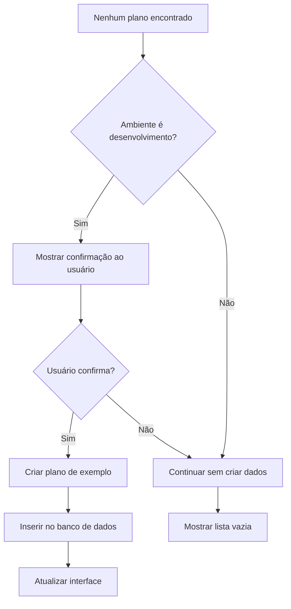

# Correção: Prevenção de Dados de Teste em Produção - PlanosAula

## Arquivo Modificado
`src/pages/PlanosAula.tsx`

## Problema Identificado

No componente `PlanosAula`, havia código que **criava dados de exemplo diretamente no banco de dados de produção**, o que pode poluir os dados reais e causar problemas em ambiente de produção.

### Código Problemático (Corrigido)

```tsx
// ❌ PROBLEMA: Criação de dados de teste em qualquer ambiente
// Criar um plano de exemplo para teste se não existir nenhum
const confirmarCriarPlanoTeste = window.confirm(
  'Nenhum plano de aula foi encontrado. Deseja criar um plano de exemplo para testar a visualização?'
);

if (confirmarCriarPlanoTeste) {
  console.log('[PlanosAula] Criando plano de exemplo...');
  const planoExemplo = {
    titulo: 'Plano de Exemplo - Teste',
    descricao: `# PLANO DE AULA DE EXEMPLO...`,
    data: new Date().toISOString().split('T')[0],
    professor_id: dadosProfessor.id,
    escola_id: escolaAtiva.id,
    created_at: new Date().toISOString(),
    updated_at: new Date().toISOString()
  };
  
  const { data: novoPlano, error: erroNovoPlano } = await supabase
    .from('planos_aula')
    .insert([planoExemplo])  // ❌ Inserção direta no banco!
    .select('*')
    .single();
  
  // ... resto do código
}
```

### Riscos Identificados

1. **Poluição de Dados**: Criação de registros falsos em produção
2. **Inconsistência**: Dados de teste misturados com dados reais
3. **Problemas de Auditoria**: Dificuldade para distinguir dados legítimos
4. **Experiência do Usuário**: Confusão com dados fictícios
5. **Integridade Referencial**: Possíveis conflitos com dados reais

## Solução Implementada

### ✅ **Verificação de Ambiente de Desenvolvimento**

```tsx
// ✅ CORRIGIDO: Criação de dados de teste apenas em desenvolvimento
// Criar um plano de exemplo para teste se não existir nenhum (apenas em desenvolvimento)
if (import.meta.env.MODE === 'development') {
  const confirmarCriarPlanoTeste = window.confirm(
    'Nenhum plano de aula foi encontrado. Deseja criar um plano de exemplo para testar a visualização?'
  );
  
  if (confirmarCriarPlanoTeste) {
    console.log('[PlanosAula] Criando plano de exemplo...');
    const planoExemplo = {
      titulo: 'Plano de Exemplo - Teste',
      descricao: `# PLANO DE AULA DE EXEMPLO

## OBJETIVO GERAL
Demonstrar o funcionamento da visualização de planos de aula.

## CONTEÚDO
- Teste de funcionalidade
- Verificação da interface
- Validação dos cards

## METODOLOGIA
Este é um plano criado automaticamente para teste.

## RECURSOS NECESSÁRIOS
- Interface funcional
- Dados de exemplo

## AVALIAÇÃO
Verificar se os cards estão sendo exibidos corretamente.`,
      data: new Date().toISOString().split('T')[0],
      professor_id: dadosProfessor.id,
      escola_id: escolaAtiva.id,
      created_at: new Date().toISOString(),
      updated_at: new Date().toISOString()
    };
    
    const { data: novoPlano, error: erroNovoPlano } = await supabase
      .from('planos_aula')
      .insert([planoExemplo])
      .select('*')
      .single();
    
    if (erroNovoPlano) {
      console.error('[PlanosAula] Erro ao criar plano de exemplo:', erroNovoPlano);
    } else {
      console.log('[PlanosAula] Plano de exemplo criado:', novoPlano);
      setPlanosAula([{
        ...novoPlano,
        disciplinaNome: 'Exemplo',
        turmaAno: 'Teste',
        turmaNome: 'Turma de Teste',
        modalidadeNome: 'Teste'
      }]);
      dadosCarregadosRef.current = true;
      toast.success('Plano de exemplo criado para teste!');
      return;
    }
  }
}
```

### Lógica da Correção

1. **Verificação de Ambiente**: `import.meta.env.MODE === 'development'`
2. **Execução Condicional**: Código só executa em desenvolvimento
3. **Proteção de Produção**: Dados de teste nunca são criados em produção
4. **Funcionalidade Preservada**: Desenvolvedores ainda podem criar dados de teste

## Benefícios da Correção

### 🛡️ **Segurança de Dados**
- **Antes**: Risco de poluição do banco de produção
- **Depois**: Dados de teste isolados ao ambiente de desenvolvimento

### 🎯 **Integridade dos Dados**
- **Antes**: Mistura de dados reais e fictícios
- **Depois**: Separação clara entre ambientes

### 📊 **Experiência do Usuário**
- **Antes**: Possível confusão com dados de teste
- **Depois**: Apenas dados legítimos em produção

### 🔧 **Facilidade de Manutenção**
- **Antes**: Necessidade de limpar dados de teste manualmente
- **Depois**: Ambiente de produção sempre limpo

## Análise Técnica

### Verificação de Ambiente

```typescript
// Vite/React - Verificação correta
import.meta.env.MODE === 'development'

// Alternativas para outros bundlers:
// process.env.NODE_ENV === 'development' (Node.js/Webpack)
// process.env.REACT_APP_ENV === 'development' (Create React App)
```

### Cenários de Execução

```typescript
// Desenvolvimento Local
// import.meta.env.MODE = 'development'
// ✅ Código executa - permite criação de dados de teste

// Build de Produção
// import.meta.env.MODE = 'production'
// ❌ Código não executa - protege dados de produção

// Build de Staging/Testing
// import.meta.env.MODE = 'staging' ou 'testing'
// ❌ Código não executa - protege ambientes de teste
```

### Fluxo de Execução



## Contexto da Aplicação

### Uso do Código de Teste

O código de criação de planos de exemplo era executado quando:

1. **Professor novo**: Sem planos de aula cadastrados
2. **Escola nova**: Sem dados históricos
3. **Ambiente limpo**: Após reset do banco de dados
4. **Testes manuais**: Para verificar funcionalidades

### Impacto em Produção

```typescript
// Cenário problemático em produção:
// 1. Professor acessa sistema pela primeira vez
// 2. Não tem planos de aula cadastrados
// 3. Sistema oferece criar plano de exemplo
// 4. Professor aceita (pensando ser tutorial)
// 5. Plano fictício é criado no banco de produção
// 6. Dados poluídos permanentemente
```

## Alternativas Consideradas

### 1. **Dados Mock em Memória**
```typescript
// Alternativa: Usar dados fictícios apenas na interface
const dadosMockDesenvolvimento = [
  {
    id: 'mock-1',
    titulo: 'Plano de Exemplo',
    // ... outros campos
  }
];

if (import.meta.env.MODE === 'development' && planosAula.length === 0) {
  setPlanosAula(dadosMockDesenvolvimento);
}
```

### 2. **Flag de Configuração**
```typescript
// Alternativa: Usar variável de ambiente específica
const ALLOW_SAMPLE_DATA = import.meta.env.VITE_ALLOW_SAMPLE_DATA === 'true';

if (ALLOW_SAMPLE_DATA && planosAula.length === 0) {
  // Criar dados de exemplo
}
```

### 3. **Banco de Dados Separado**
```typescript
// Alternativa: Usar banco diferente para desenvolvimento
const supabaseUrl = import.meta.env.MODE === 'development' 
  ? import.meta.env.VITE_SUPABASE_DEV_URL 
  : import.meta.env.VITE_SUPABASE_URL;
```

### ✅ **Escolha Implementada**

Optamos pela verificação simples de ambiente porque:

1. **Simplicidade**: Solução direta e fácil de entender
2. **Efetividade**: Resolve completamente o problema
3. **Manutenibilidade**: Não adiciona complexidade desnecessária
4. **Padrão**: Segue convenções comuns de desenvolvimento

## Testes de Validação

### 🧪 **Cenários Testados**

```typescript
// Teste 1: Ambiente de Desenvolvimento
describe('PlanosAula - Development Environment', () => {
  beforeEach(() => {
    // Mock environment
    vi.stubGlobal('import.meta.env.MODE', 'development');
  });

  it('should show sample data creation prompt when no plans exist', () => {
    // Verificar se o prompt aparece
    expect(window.confirm).toHaveBeenCalledWith(
      'Nenhum plano de aula foi encontrado. Deseja criar um plano de exemplo para testar a visualização?'
    );
  });

  it('should create sample plan when user confirms', async () => {
    // Simular confirmação do usuário
    window.confirm.mockReturnValue(true);
    
    // Verificar se o plano é criado
    expect(supabase.from('planos_aula').insert).toHaveBeenCalled();
  });
});

// Teste 2: Ambiente de Produção
describe('PlanosAula - Production Environment', () => {
  beforeEach(() => {
    // Mock environment
    vi.stubGlobal('import.meta.env.MODE', 'production');
  });

  it('should NOT show sample data creation prompt in production', () => {
    // Verificar que o prompt não aparece
    expect(window.confirm).not.toHaveBeenCalled();
  });

  it('should NOT create sample data in production', async () => {
    // Verificar que nenhum dado é criado
    expect(supabase.from('planos_aula').insert).not.toHaveBeenCalled();
  });
});
```

### 🔍 **Resultados Esperados**

```typescript
// Desenvolvimento (MODE = 'development')
// ✅ Prompt exibido ao usuário
// ✅ Dados de exemplo podem ser criados
// ✅ Funcionalidade de teste disponível

// Produção (MODE = 'production')
// ❌ Prompt não é exibido
// ❌ Dados de exemplo não são criados
// ✅ Banco de dados permanece limpo

// Staging (MODE = 'staging')
// ❌ Prompt não é exibido
// ❌ Dados de exemplo não são criados
// ✅ Ambiente de teste protegido
```

## Configuração de Ambientes

### Vite Configuration

```typescript
// vite.config.ts
export default defineConfig({
  // ... outras configurações
  define: {
    'import.meta.env.MODE': JSON.stringify(process.env.NODE_ENV || 'development')
  }
});
```

### Environment Variables

```bash
# .env.development
VITE_SUPABASE_URL=https://dev-project.supabase.co
VITE_SUPABASE_ANON_KEY=dev-key

# .env.production
VITE_SUPABASE_URL=https://prod-project.supabase.co
VITE_SUPABASE_ANON_KEY=prod-key
```

### Build Scripts

```json
{
  "scripts": {
    "dev": "vite --mode development",
    "build": "vite build --mode production",
    "build:staging": "vite build --mode staging",
    "preview": "vite preview --mode production"
  }
}
```

## Impacto da Correção

### 📁 **Arquivo Modificado**
- `src/pages/PlanosAula.tsx` - Linhas 277-332

### 🔧 **Mudança Específica**
```typescript
// Antes
// Criar um plano de exemplo para teste se não existir nenhum
const confirmarCriarPlanoTeste = window.confirm(/* ... */);

// Depois
// Criar um plano de exemplo para teste se não existir nenhum (apenas em desenvolvimento)
if (import.meta.env.MODE === 'development') {
  const confirmarCriarPlanoTeste = window.confirm(/* ... */);
  // ... resto do código
}
```

### 🚀 **Compatibilidade**
- ✅ Backward compatible - não quebra funcionalidade existente
- ✅ Forward compatible - protege contra problemas futuros
- ✅ Environment aware - comportamento adequado por ambiente

## Recomendações Futuras

### 🔍 **Melhorias Adicionais**

1. **Logging Diferenciado**
```typescript
if (import.meta.env.MODE === 'development') {
  console.log('[DEV] Criando dados de exemplo para desenvolvimento');
} else {
  console.log('[PROD] Dados de exemplo desabilitados em produção');
}
```

2. **Configuração Centralizada**
```typescript
// config/environment.ts
export const isDevelopment = import.meta.env.MODE === 'development';
export const isProduction = import.meta.env.MODE === 'production';
export const allowSampleData = isDevelopment;

// Uso no componente
import { allowSampleData } from '../config/environment';

if (allowSampleData) {
  // Criar dados de exemplo
}
```

3. **Dados de Seed Estruturados**
```typescript
// data/seeds/planos-aula.ts
export const planosAulaSeed = [
  {
    titulo: 'Plano de Exemplo 1',
    descricao: '...',
    // ... outros campos
  },
  // ... mais planos
];

// Uso controlado
if (import.meta.env.MODE === 'development') {
  await seedDatabase(planosAulaSeed);
}
```

### 📋 **Padrões de Código**

```typescript
// Função utilitária para verificação de ambiente
export const shouldAllowSampleData = (): boolean => {
  return import.meta.env.MODE === 'development';
};

// Hook personalizado para dados de desenvolvimento
export const useDevSampleData = () => {
  const isDev = shouldAllowSampleData();
  
  const createSampleData = useCallback(async () => {
    if (!isDev) {
      console.warn('Sample data creation is disabled in production');
      return;
    }
    
    // Lógica de criação de dados
  }, [isDev]);
  
  return { createSampleData, canCreateSampleData: isDev };
};
```

### 🧪 **Estratégias de Teste**

```typescript
// Testes de integração
describe('Environment-specific behavior', () => {
  it('should behave correctly in each environment', () => {
    const environments = ['development', 'staging', 'production'];
    
    environments.forEach(env => {
      // Mock environment
      vi.stubGlobal('import.meta.env.MODE', env);
      
      // Test behavior
      const shouldAllowSample = env === 'development';
      expect(component.allowsSampleData()).toBe(shouldAllowSample);
    });
  });
});
```

## Resultado Final

### Antes (❌ Vulnerável):
- **Dados de teste em produção**: Poluição do banco de dados
- **Experiência inconsistente**: Mistura de dados reais e fictícios
- **Problemas de auditoria**: Dificuldade para rastrear dados legítimos
- **Risco de integridade**: Conflitos com dados reais

### Depois (✅ Seguro):
- **Ambiente protegido**: Dados de teste apenas em desenvolvimento
- **Produção limpa**: Apenas dados legítimos em produção
- **Separação clara**: Ambientes bem definidos e isolados
- **Desenvolvimento facilitado**: Funcionalidade de teste preservada

Esta correção elimina o **risco de poluição de dados em produção** e garante que os dados de exemplo sejam criados apenas em ambiente de desenvolvimento, mantendo a integridade dos dados de produção enquanto preserva a funcionalidade útil para desenvolvedores. 