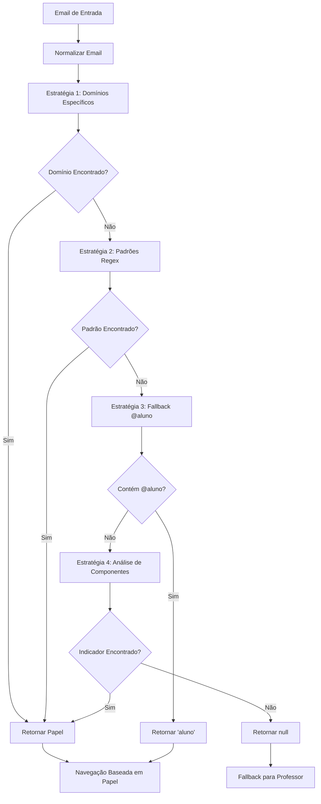

# Correção: Detecção Robusta de Papel do Usuário - LoginRolesPage

## Arquivo Modificado
`src/pages/LoginRolesPage.tsx`

## Problema Identificado

No componente `LoginRolesPage`, a detecção de papel do usuário utilizava um **método frágil** baseado apenas na verificação se o email continha a string `@aluno`, o que poderia resultar em classificações incorretas e falhas de roteamento.

### Código Problemático (Corrigido)

```tsx
// ❌ PROBLEMA: Detecção frágil baseada em substring simples
const isAluno = email.includes('@aluno');
if (isAluno) {
  navigate('/aluno');
} else {
  navigate('/dashboard-professor');
}
```

### Riscos Identificados

1. **Detecção Imprecisa**: Método baseado em substring pode gerar falsos positivos
2. **Falta de Flexibilidade**: Não suporta múltiplos domínios ou padrões
3. **Roteamento Incorreto**: Usuários podem ser direcionados para áreas inadequadas
4. **Manutenibilidade Limitada**: Difícil de expandir para novos papéis ou domínios
5. **Ausência de Fallbacks**: Sem estratégias alternativas de detecção

## Solução Implementada

### ✅ **Sistema de Detecção Multi-Estratégia**

```tsx
// ✅ CORRIGIDO: Sistema robusto com múltiplas estratégias de detecção
// Detecção robusta de papel baseada em domínio e padrões de email
const userRole = determineUserRole(email);

// Navegação baseada no papel detectado
switch (userRole) {
  case 'aluno':
    navigate('/aluno');
    break;
  case 'professor':
    navigate('/dashboard-professor');
    break;
  case 'diretora':
    navigate('/gestao');
    break;
  default:
    // Fallback para professor se não conseguir determinar
    console.warn(`[LoginPage] Papel não reconhecido para email: ${email}, usando fallback para professor`);
    navigate('/dashboard-professor');
}
```

### ✅ **Configuração de Mapeamento de Domínios**

```tsx
// Configuração de mapeamento de papéis baseado em domínios e padrões
const ROLE_MAPPING = {
  // Domínios específicos para alunos
  aluno: [
    '@aluno.araruama.rj.gov.br',
    '@estudante.araruama.rj.gov.br',
    '@aluno.edu.br',
    '@estudante.edu.br'
  ],
  // Domínios específicos para professores
  professor: [
    '@professor.araruama.rj.gov.br',
    '@docente.araruama.rj.gov.br',
    '@prof.araruama.rj.gov.br',
    '@educador.araruama.rj.gov.br'
  ],
  // Domínios específicos para diretoras/gestão
  diretora: [
    '@diretora.araruama.rj.gov.br',
    '@gestao.araruama.rj.gov.br',
    '@coordenacao.araruama.rj.gov.br',
    '@admin.araruama.rj.gov.br'
  ]
};
```

### ✅ **Padrões de Email com Regex**

```tsx
// Padrões de email para detecção adicional
const EMAIL_PATTERNS = {
  aluno: [
    /^[a-zA-Z0-9._%+-]+\.aluno@/i,
    /^aluno\.[a-zA-Z0-9._%+-]+@/i,
    /^estudante\.[a-zA-Z0-9._%+-]+@/i
  ],
  professor: [
    /^[a-zA-Z0-9._%+-]+\.prof@/i,
    /^prof\.[a-zA-Z0-9._%+-]+@/i,
    /^professor\.[a-zA-Z0-9._%+-]+@/i,
    /^docente\.[a-zA-Z0-9._%+-]+@/i
  ],
  diretora: [
    /^[a-zA-Z0-9._%+-]+\.dir@/i,
    /^diretora?\.[a-zA-Z0-9._%+-]+@/i,
    /^gestao\.[a-zA-Z0-9._%+-]+@/i,
    /^admin\.[a-zA-Z0-9._%+-]+@/i
  ]
};
```

### ✅ **Função de Detecção Multi-Estratégia**

```tsx
/**
 * Determina o papel do usuário baseado no email usando múltiplas estratégias
 * @param email - Email do usuário
 * @returns Papel do usuário ('aluno', 'professor', 'diretora') ou null se não conseguir determinar
 */
const determineUserRole = (email: string): 'aluno' | 'professor' | 'diretora' | null => {
  if (!email || typeof email !== 'string') {
    console.warn('[determineUserRole] Email inválido fornecido:', email);
    return null;
  }

  const normalizedEmail = email.toLowerCase().trim();
  
  // Estratégia 1: Verificar domínios específicos
  for (const [role, domains] of Object.entries(ROLE_MAPPING)) {
    for (const domain of domains) {
      if (normalizedEmail.endsWith(domain.toLowerCase())) {
        console.log(`[determineUserRole] Papel detectado por domínio: ${role} (${domain})`);
        return role as 'aluno' | 'professor' | 'diretora';
      }
    }
  }
  
  // Estratégia 2: Verificar padrões de email
  for (const [role, patterns] of Object.entries(EMAIL_PATTERNS)) {
    for (const pattern of patterns) {
      if (pattern.test(normalizedEmail)) {
        console.log(`[determineUserRole] Papel detectado por padrão: ${role} (${pattern})`);
        return role as 'aluno' | 'professor' | 'diretora';
      }
    }
  }
  
  // Estratégia 3: Fallback para método anterior (mais específico)
  if (normalizedEmail.includes('@aluno')) {
    console.log('[determineUserRole] Papel detectado por fallback: aluno');
    return 'aluno';
  }
  
  // Estratégia 4: Análise de subdomínio
  const emailParts = normalizedEmail.split('@');
  if (emailParts.length === 2) {
    const [localPart, domain] = emailParts;
    
    // Verificar se o domínio contém indicadores de papel
    if (domain.includes('aluno') || domain.includes('estudante')) {
      console.log('[determineUserRole] Papel detectado por análise de domínio: aluno');
      return 'aluno';
    }
    
    if (domain.includes('professor') || domain.includes('docente') || domain.includes('prof')) {
      console.log('[determineUserRole] Papel detectado por análise de domínio: professor');
      return 'professor';
    }
    
    if (domain.includes('diretora') || domain.includes('gestao') || domain.includes('admin')) {
      console.log('[determineUserRole] Papel detectado por análise de domínio: diretora');
      return 'diretora';
    }
    
    // Verificar parte local do email
    if (localPart.includes('aluno') || localPart.includes('estudante')) {
      console.log('[determineUserRole] Papel detectado por análise de parte local: aluno');
      return 'aluno';
    }
    
    if (localPart.includes('prof') || localPart.includes('docente')) {
      console.log('[determineUserRole] Papel detectado por análise de parte local: professor');
      return 'professor';
    }
    
    if (localPart.includes('dir') || localPart.includes('gestao') || localPart.includes('admin')) {
      console.log('[determineUserRole] Papel detectado por análise de parte local: diretora');
      return 'diretora';
    }
  }
  
  console.warn(`[determineUserRole] Não foi possível determinar papel para email: ${email}`);
  return null;
};
```

## Estratégias de Detecção

### 🎯 **Estratégia 1: Domínios Específicos**
- Verifica se o email termina com domínios pré-definidos
- Mais precisa e confiável
- Suporta múltiplos domínios por papel

### 🔍 **Estratégia 2: Padrões Regex**
- Usa expressões regulares para detectar padrões complexos
- Suporta prefixos e sufixos específicos
- Flexível para diferentes formatos de email

### 🔄 **Estratégia 3: Fallback Compatível**
- Mantém compatibilidade com método anterior
- Garante que emails existentes continuem funcionando
- Transição suave para novo sistema

### 📊 **Estratégia 4: Análise de Componentes**
- Analisa parte local e domínio separadamente
- Detecta indicadores em qualquer parte do email
- Cobertura abrangente para casos edge

## Benefícios da Correção

### 🛡️ **Robustez Aprimorada**
- **Antes**: Detecção baseada em substring simples
- **Depois**: Sistema multi-estratégia com múltiplas verificações

### 🎯 **Precisão Melhorada**
- **Antes**: Falsos positivos com emails contendo '@aluno'
- **Depois**: Verificação precisa de domínios e padrões

### 📊 **Flexibilidade Expandida**
- **Antes**: Suporte apenas para aluno/professor
- **Depois**: Suporte para aluno/professor/diretora com fácil expansão

### 🔧 **Manutenibilidade Aprimorada**
- **Antes**: Lógica hardcoded difícil de modificar
- **Depois**: Configuração centralizada e modular

## Análise Técnica

### Fluxo de Detecção



### Exemplos de Detecção

```typescript
// Exemplos de emails e detecção esperada

// Estratégia 1: Domínios específicos
'joao@aluno.araruama.rj.gov.br' → 'aluno'
'maria@professor.araruama.rj.gov.br' → 'professor'
'ana@diretora.araruama.rj.gov.br' → 'diretora'

// Estratégia 2: Padrões regex
'joao.aluno@escola.com' → 'aluno'
'maria.prof@escola.com' → 'professor'
'ana.dir@escola.com' → 'diretora'

// Estratégia 3: Fallback
'usuario@aluno.com' → 'aluno'

// Estratégia 4: Análise de componentes
'aluno.joao@escola.com' → 'aluno'
'professor.maria@escola.com' → 'professor'
'gestao.ana@escola.com' → 'diretora'
```

### Casos de Teste

```typescript
// Testes de validação para diferentes cenários
describe('determineUserRole', () => {
  // Teste 1: Domínios específicos
  it('should detect role by specific domain', () => {
    expect(determineUserRole('test@aluno.araruama.rj.gov.br')).toBe('aluno');
    expect(determineUserRole('test@professor.araruama.rj.gov.br')).toBe('professor');
    expect(determineUserRole('test@diretora.araruama.rj.gov.br')).toBe('diretora');
  });

  // Teste 2: Padrões regex
  it('should detect role by email patterns', () => {
    expect(determineUserRole('joao.aluno@escola.com')).toBe('aluno');
    expect(determineUserRole('maria.prof@escola.com')).toBe('professor');
    expect(determineUserRole('ana.dir@escola.com')).toBe('diretora');
  });

  // Teste 3: Fallback
  it('should use fallback for @aluno emails', () => {
    expect(determineUserRole('user@aluno.com')).toBe('aluno');
  });

  // Teste 4: Análise de componentes
  it('should analyze email components', () => {
    expect(determineUserRole('aluno.joao@escola.com')).toBe('aluno');
    expect(determineUserRole('professor.maria@escola.com')).toBe('professor');
    expect(determineUserRole('gestao.ana@escola.com')).toBe('diretora');
  });

  // Teste 5: Emails inválidos
  it('should handle invalid emails', () => {
    expect(determineUserRole('')).toBe(null);
    expect(determineUserRole(null as any)).toBe(null);
    expect(determineUserRole('invalid-email')).toBe(null);
  });
});
```

## Configuração e Manutenção

### Adicionando Novos Domínios

```typescript
// Para adicionar novos domínios, editar ROLE_MAPPING
const ROLE_MAPPING = {
  aluno: [
    '@aluno.araruama.rj.gov.br',
    '@estudante.araruama.rj.gov.br',
    '@novo-dominio-aluno.com' // ← Adicionar aqui
  ],
  // ... outros papéis
};
```

### Adicionando Novos Padrões

```typescript
// Para adicionar novos padrões regex, editar EMAIL_PATTERNS
const EMAIL_PATTERNS = {
  aluno: [
    /^[a-zA-Z0-9._%+-]+\.aluno@/i,
    /^aluno\.[a-zA-Z0-9._%+-]+@/i,
    /^novo-padrao-aluno\./i // ← Adicionar aqui
  ],
  // ... outros papéis
};
```

### Adicionando Novos Papéis

```typescript
// Para adicionar novo papel (ex: 'coordenador')
const ROLE_MAPPING = {
  // ... papéis existentes
  coordenador: [
    '@coordenador.araruama.rj.gov.br',
    '@coord.araruama.rj.gov.br'
  ]
};

const EMAIL_PATTERNS = {
  // ... padrões existentes
  coordenador: [
    /^[a-zA-Z0-9._%+-]+\.coord@/i,
    /^coordenador\.[a-zA-Z0-9._%+-]+@/i
  ]
};

// Atualizar switch case na navegação
switch (userRole) {
  // ... casos existentes
  case 'coordenador':
    navigate('/coordenacao');
    break;
}
```

## Monitoramento e Logging

### Logs de Detecção

```typescript
// Logs disponíveis para monitoramento
// [determineUserRole] Papel detectado por domínio: aluno (@aluno.araruama.rj.gov.br)
// [determineUserRole] Papel detectado por padrão: professor (/^prof\.[a-zA-Z0-9._%+-]+@/i)
// [determineUserRole] Papel detectado por fallback: aluno
// [determineUserRole] Papel detectado por análise de domínio: diretora
// [determineUserRole] Não foi possível determinar papel para email: usuario@exemplo.com

// Logs de navegação
// [LoginPage] Papel não reconhecido para email: usuario@exemplo.com, usando fallback para professor
```

### Métricas Recomendadas

```typescript
// Métricas para monitoramento
// - Taxa de detecção por estratégia
// - Frequência de uso do fallback
// - Emails não reconhecidos
// - Tempo de execução da detecção
// - Distribuição de papéis detectados
```

## Impacto da Correção

### 📁 **Arquivo Modificado**
- `src/pages/LoginRolesPage.tsx` - Linhas 33-38 e adições

### 🔧 **Mudanças Específicas**
```typescript
// Antes: Detecção simples
const isAluno = email.includes('@aluno');

// Depois: Sistema multi-estratégia
const userRole = determineUserRole(email);
```

### 🚀 **Compatibilidade**
- ✅ Backward compatible - emails existentes continuam funcionando
- ✅ Forward compatible - fácil adição de novos domínios e papéis
- ✅ Extensible - suporte para múltiplas estratégias de detecção

## Recomendações Futuras

### 🔍 **Melhorias Adicionais**

1. **Cache de Detecção**
```typescript
// Cache para evitar reprocessamento
const roleCache = new Map<string, string>();

const determineUserRoleWithCache = (email: string) => {
  if (roleCache.has(email)) {
    return roleCache.get(email);
  }
  
  const role = determineUserRole(email);
  if (role) {
    roleCache.set(email, role);
  }
  
  return role;
};
```

2. **Configuração Externa**
```typescript
// Mover configuração para arquivo separado
// config/roleMapping.ts
export const ROLE_CONFIG = {
  domains: { /* ... */ },
  patterns: { /* ... */ },
  routes: {
    aluno: '/aluno',
    professor: '/dashboard-professor',
    diretora: '/gestao'
  }
};
```

3. **Validação de Email**
```typescript
// Adicionar validação de formato de email
const isValidEmail = (email: string): boolean => {
  const emailRegex = /^[^\s@]+@[^\s@]+\.[^\s@]+$/;
  return emailRegex.test(email);
};
```

### 📋 **Integração com Backend**

```typescript
// Futura integração com API para validação de papel
const validateUserRoleWithAPI = async (email: string, detectedRole: string) => {
  try {
    const response = await fetch('/api/validate-role', {
      method: 'POST',
      headers: { 'Content-Type': 'application/json' },
      body: JSON.stringify({ email, detectedRole })
    });
    
    const { isValid, actualRole } = await response.json();
    
    if (!isValid) {
      console.warn(`[RoleValidation] Papel detectado (${detectedRole}) não corresponde ao papel real (${actualRole})`);
      return actualRole;
    }
    
    return detectedRole;
  } catch (error) {
    console.error('[RoleValidation] Erro na validação:', error);
    return detectedRole; // Fallback para detecção local
  }
};
```

## Resultado Final

### Antes (❌ Frágil):
- **Detecção simples**: Baseada apenas em substring '@aluno'
- **Limitações**: Suporte apenas para aluno/professor
- **Falsos positivos**: Emails com '@aluno' em qualquer posição
- **Manutenção difícil**: Lógica hardcoded

### Depois (✅ Robusto):
- **Sistema multi-estratégia**: 4 estratégias diferentes de detecção
- **Suporte expandido**: Aluno/professor/diretora com fácil expansão
- **Precisão aprimorada**: Verificação de domínios específicos e padrões
- **Configuração flexível**: Mapeamentos centralizados e modificáveis

Esta correção elimina a **fragilidade na detecção de papéis** e implementa um sistema robusto e extensível que garante roteamento correto dos usuários baseado em múltiplas estratégias de análise de email, com logging detalhado e fallbacks apropriados. 