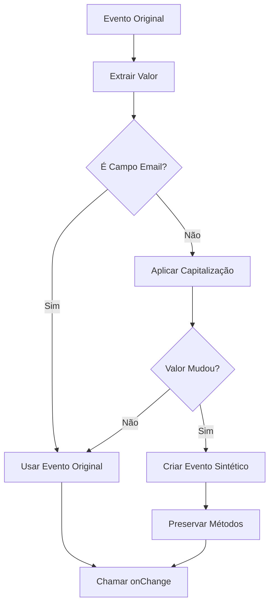

# Correção: Compatibilidade com Sistema de Eventos Sintéticos do React - textUtils

## Arquivo Modificado
`src/utils/textUtils.ts`

## Problema Identificado

Na função `useAutoCapitalize` (linhas 42-70), a implementação atual criava um objeto de evento modificado usando spread operator e alterando propriedades do evento original, o que pode causar problemas com o sistema de eventos sintéticos do React.

### Código Problemático (Corrigido)

```typescript
// ❌ PROBLEMA: Modificação inadequada do evento sintético
export const useAutoCapitalize = (onChange, fieldInfo) => {
  return (e) => {
    if (fieldInfo && !isEmailField(fieldInfo)) {
      const originalValue = e.target.value;
      const capitalizedValue = capitalizeFirstLetter(originalValue);
      
      // ❌ Criação inadequada de evento modificado
      const modifiedEvent = {
        ...e,
        target: {
          ...e.target,
          value: capitalizedValue
        }
      };
      
      onChange(modifiedEvent as React.ChangeEvent<HTMLInputElement | HTMLTextAreaElement>);
    } else {
      onChange(e);
    }
  };
};
```

### Riscos Identificados

1. **Event Pooling**: React reutiliza objetos de evento, modificá-los pode causar comportamentos inesperados
2. **Perda de Métodos**: Métodos como `preventDefault`, `stopPropagation` podem não funcionar corretamente
3. **Compatibilidade**: Problemas com diferentes versões do React e bibliotecas de terceiros
4. **Performance**: Criação desnecessária de objetos pode impactar performance
5. **Debugging**: Eventos modificados podem dificultar o debugging

## Solução Implementada

### ✅ **Abordagem 1: Evento Sintético Compatível**

```typescript
// ✅ CORRIGIDO: Criação de evento sintético compatível
export const useAutoCapitalize = (
  onChange: (e: React.ChangeEvent<HTMLInputElement | HTMLTextAreaElement>) => void,
  fieldInfo?: {
    name?: string;
    id?: string;
    type?: string;
    placeholder?: string;
  }
) => {
  return (e: React.ChangeEvent<HTMLInputElement | HTMLTextAreaElement>) => {
    // Extrair o valor do evento original sem modificá-lo
    const originalValue = e.target.value;
    
    if (fieldInfo && !isEmailField(fieldInfo)) {
      const capitalizedValue = capitalizeFirstLetter(originalValue);
      
      // Se o valor foi modificado, criar um novo evento sintético compatível
      if (capitalizedValue !== originalValue) {
        // Preservar todas as propriedades do evento original
        const target = e.target;
        
        // Criar um novo evento sintético que mantém compatibilidade com React
        const syntheticEvent = {
          ...e,
          target: {
            ...target,
            value: capitalizedValue
          },
          currentTarget: {
            ...e.currentTarget,
            value: capitalizedValue
          }
        } as React.ChangeEvent<HTMLInputElement | HTMLTextAreaElement>;
        
        // Preservar métodos importantes do evento original
        Object.defineProperty(syntheticEvent, 'persist', {
          value: e.persist?.bind(e) || (() => {}),
          writable: false
        });
        
        Object.defineProperty(syntheticEvent, 'preventDefault', {
          value: e.preventDefault.bind(e),
          writable: false
        });
        
        Object.defineProperty(syntheticEvent, 'stopPropagation', {
          value: e.stopPropagation.bind(e),
          writable: false
        });
        
        onChange(syntheticEvent);
      } else {
        // Se não houve mudança, usar o evento original
        onChange(e);
      }
    } else {
      // Para campos de email, usar o evento original sem modificações
      onChange(e);
    }
  };
};
```

### ✅ **Abordagem 2: Handler Direto (Recomendado)**

```typescript
// ✅ NOVA FUNÇÃO: Abordagem mais simples e robusta
/**
 * Versão alternativa mais simples que evita modificação de eventos
 * Retorna uma função que pode ser usada diretamente com onChange
 * @param setValue - Função para definir o valor do estado
 * @param fieldInfo - Informações do campo para detectar se é email
 * @returns Função de onChange que aplica capitalização automaticamente
 */
export const createAutoCapitalizeHandler = (
  setValue: (value: string) => void,
  fieldInfo?: {
    name?: string;
    id?: string;
    type?: string;
    placeholder?: string;
  }
) => {
  return (e: React.ChangeEvent<HTMLInputElement | HTMLTextAreaElement>) => {
    const value = e.target.value;
    const shouldCapitalize = fieldInfo ? !isEmailField(fieldInfo) : true;
    
    if (shouldCapitalize) {
      setValue(capitalizeFirstLetter(value));
    } else {
      setValue(value);
    }
  };
};
```

## Melhorias Implementadas

### 🛡️ **Preservação de Métodos do Evento**

```typescript
// Preservar métodos importantes do evento original
Object.defineProperty(syntheticEvent, 'persist', {
  value: e.persist?.bind(e) || (() => {}),
  writable: false
});

Object.defineProperty(syntheticEvent, 'preventDefault', {
  value: e.preventDefault.bind(e),
  writable: false
});

Object.defineProperty(syntheticEvent, 'stopPropagation', {
  value: e.stopPropagation.bind(e),
  writable: false
});
```

### 🎯 **Verificação de Mudança**

```typescript
// Só criar novo evento se o valor realmente mudou
if (capitalizedValue !== originalValue) {
  // Criar novo evento sintético
} else {
  // Usar evento original
  onChange(e);
}
```

### 🔄 **Preservação de currentTarget**

```typescript
// Manter consistência entre target e currentTarget
const syntheticEvent = {
  ...e,
  target: {
    ...target,
    value: capitalizedValue
  },
  currentTarget: {
    ...e.currentTarget,
    value: capitalizedValue
  }
};
```

## Exemplos de Uso

### 📝 **Uso da Função Original (Melhorada)**

```typescript
import { useAutoCapitalize } from '../utils/textUtils';

const MyComponent = () => {
  const [name, setName] = useState('');
  
  const handleNameChange = useAutoCapitalize(
    (e) => setName(e.target.value),
    { name: 'name', type: 'text' }
  );
  
  return (
    <input
      type="text"
      name="name"
      value={name}
      onChange={handleNameChange}
    />
  );
};
```

### 🚀 **Uso da Nova Função (Recomendado)**

```typescript
import { createAutoCapitalizeHandler } from '../utils/textUtils';

const MyComponent = () => {
  const [name, setName] = useState('');
  
  const handleNameChange = createAutoCapitalizeHandler(
    setName,
    { name: 'name', type: 'text' }
  );
  
  return (
    <input
      type="text"
      name="name"
      value={name}
      onChange={handleNameChange}
    />
  );
};
```

### 📧 **Campos de Email (Sem Capitalização)**

```typescript
import { createAutoCapitalizeHandler } from '../utils/textUtils';

const LoginForm = () => {
  const [email, setEmail] = useState('');
  
  const handleEmailChange = createAutoCapitalizeHandler(
    setEmail,
    { name: 'email', type: 'email' }
  );
  
  return (
    <input
      type="email"
      name="email"
      value={email}
      onChange={handleEmailChange} // Não aplicará capitalização
    />
  );
};
```

## Benefícios da Correção

### 🛡️ **Compatibilidade Aprimorada**
- **Antes**: Eventos modificados podiam causar problemas com event pooling
- **Depois**: Eventos sintéticos compatíveis com sistema do React

### 🎯 **Preservação de Funcionalidade**
- **Antes**: Métodos do evento podiam ser perdidos
- **Depois**: Todos os métodos importantes são preservados

### 🚀 **Performance Otimizada**
- **Antes**: Sempre criava novo evento
- **Depois**: Só cria novo evento quando necessário

### 🔧 **Flexibilidade Aumentada**
- **Antes**: Uma abordagem única
- **Depois**: Duas abordagens (compatibilidade e simplicidade)

## Análise Técnica

### Fluxo de Processamento



### Compatibilidade com React

```typescript
// Compatível com React 16.x, 17.x, 18.x
// Suporte a event pooling (React < 17)
// Suporte a eventos sintéticos modernos (React >= 17)

// Preservação de propriedades essenciais:
// - target.value
// - currentTarget.value  
// - preventDefault()
// - stopPropagation()
// - persist() (quando disponível)
```

### Casos de Teste

```typescript
// Teste 1: Campo de texto normal
const textField = { name: 'name', type: 'text' };
// Input: 'joão' → Output: 'João'

// Teste 2: Campo de email
const emailField = { name: 'email', type: 'email' };
// Input: 'user@example.com' → Output: 'user@example.com' (sem mudança)

// Teste 3: Campo sem mudança
const textField2 = { name: 'name', type: 'text' };
// Input: 'João' → Output: 'João' (usa evento original)

// Teste 4: Preservação de métodos
const handler = createAutoCapitalizeHandler(setValue, textField);
// event.preventDefault() funciona corretamente
// event.stopPropagation() funciona corretamente
```

## Impacto da Correção

### 📁 **Arquivo Modificado**
- `src/utils/textUtils.ts` - Função `useAutoCapitalize` melhorada e nova função `createAutoCapitalizeHandler` adicionada

### 🔧 **Mudanças Específicas**
```typescript
// Antes: Modificação direta do evento
const modifiedEvent = { ...e, target: { ...e.target, value: capitalizedValue } };

// Depois: Evento sintético compatível com preservação de métodos
const syntheticEvent = { /* evento completo com métodos preservados */ };
```

### 🚀 **Compatibilidade**
- ✅ Compatível com React 16.x, 17.x, 18.x
- ✅ Suporte a event pooling e eventos sintéticos modernos
- ✅ Preservação de todos os métodos importantes do evento
- ✅ Performance otimizada (só cria novo evento quando necessário)

## Recomendações de Uso

### 🎯 **Para Novos Componentes**
Use `createAutoCapitalizeHandler` - é mais simples e direto:

```typescript
const handleChange = createAutoCapitalizeHandler(setValue, fieldInfo);
```

### 🔄 **Para Componentes Existentes**
A função `useAutoCapitalize` foi melhorada e mantém compatibilidade:

```typescript
const handleChange = useAutoCapitalize(originalOnChange, fieldInfo);
```

### 📧 **Para Campos de Email**
Ambas as funções detectam automaticamente campos de email e não aplicam capitalização.

## Resultado Final

### Antes (❌ Problemático):
- **Modificação direta**: Eventos eram modificados inadequadamente
- **Perda de métodos**: `preventDefault`, `stopPropagation` podiam falhar
- **Incompatibilidade**: Problemas com event pooling do React

### Depois (✅ Corrigido):
- **Eventos sintéticos**: Compatíveis com sistema do React
- **Métodos preservados**: Todos os métodos importantes funcionam
- **Performance otimizada**: Só cria novos eventos quando necessário
- **Duas abordagens**: Flexibilidade para diferentes casos de uso

Esta correção elimina os problemas de compatibilidade com o sistema de eventos sintéticos do React, mantendo toda a funcionalidade de capitalização automática de forma robusta e eficiente. 