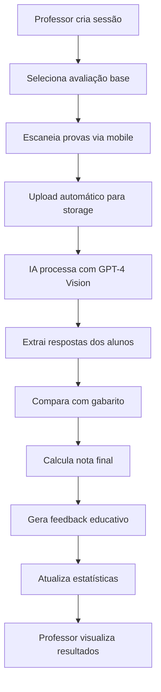

# 📱 Sistema de Correção Automática Mobile - ExProfessor

## 🎯 **Visão Geral**

O Sistema de Correção Automática Mobile permite que professores escaneiem e corrijam provas automaticamente usando apenas um dispositivo móvel. A IA analisa as respostas dos alunos e fornece correção instantânea com feedback detalhado.

## ✨ **Funcionalidades Implementadas**

### 🔧 **Backend Completo**
- ✅ **Banco de Dados**: Tabelas para sessões, avaliações escaneadas, questões e logs
- ✅ **Edge Functions**: 3 funções serverless deployadas
- ✅ **Storage**: Bucket configurado para imagens de provas
- ✅ **Segurança**: Row Level Security (RLS) implementado
- ✅ **APIs**: Endpoints completos para todas as operações

### 📱 **Interface Mobile**
- ✅ **Página Principal**: Lista de sessões ativas com estatísticas
- ✅ **Escaneamento**: Interface de câmera com guias visuais
- ✅ **Detalhes**: Visualização completa dos resultados
- ✅ **Nova Sessão**: Criação baseada em avaliações existentes
- ✅ **Navegação**: Rotas configuradas e protegidas

### 🤖 **Inteligência Artificial**
- ✅ **GPT-4 Vision**: Análise automática de provas escaneadas
- ✅ **Processamento**: Extração de respostas e cálculo de notas
- ✅ **Feedback**: Comentários educativos personalizados
- ✅ **Qualidade**: Sistema de detecção de problemas

## 🚀 **Como Usar**

### **1. Acesso ao Sistema**
```
1. Faça login no ExProfessor
2. No Dashboard, clique em "Correção Mobile"
3. Ou acesse diretamente: /correcao-mobile
```

### **2. Criar Nova Sessão**
```
1. Clique em "Nova Sessão de Correção"
2. Selecione uma avaliação existente
3. Configure título e número de provas esperadas
4. Clique em "Criar Sessão"
```

### **3. Escanear Provas**
```
1. Na sessão criada, clique em "Escanear"
2. Permita acesso à câmera
3. Posicione a prova dentro da área marcada
4. Toque no botão de captura
5. Confirme e envie a imagem
```

### **4. Acompanhar Resultados**
```
1. Clique em "Ver Detalhes" na sessão
2. Visualize estatísticas em tempo real
3. Veja notas e feedback da IA
4. Identifique provas que precisam de revisão
```

## 🏗️ **Arquitetura Técnica**

### **Frontend (React/TypeScript)**
```
src/
├── pages/CorrecaoMobile/
│   ├── index.tsx                 # Página principal
│   ├── CorrecaoMobilePage.tsx    # Lista de sessões
│   ├── EscanearProva.tsx         # Interface de câmera
│   ├── DetalhesSessao.tsx        # Resultados detalhados
│   └── NovaSessao.tsx            # Criação de sessão
├── services/
│   └── correcaoMobileService.ts  # API client
├── hooks/
│   └── useCamera.ts              # Hook para câmera
└── components/
    └── layout/
        └── MobileNavigation.tsx  # Navegação mobile
```

### **Backend (Supabase)**
```
Database:
├── sessoes_escaneamento          # Sessões de correção
├── avaliacoes_escaneadas         # Provas individuais
├── questoes_corrigidas_detalhes  # Detalhes por questão
└── logs_processamento_ia         # Auditoria completa

Edge Functions:
├── correcao-automatica-provas    # Correção com IA
├── upload-prova-mobile           # Upload de imagens
└── gestao-sessoes-correcao       # API de sessões

Storage:
└── avaliacoes-escaneadas         # Bucket para imagens
```

## 🔄 **Fluxo de Funcionamento**



## 📊 **Recursos da IA**

### **Análise Visual**
- Reconhecimento de texto manuscrito
- Identificação de questões e respostas
- Detecção de nome e matrícula do aluno
- Análise de qualidade da imagem

### **Correção Inteligente**
- Comparação com gabarito oficial
- Cálculo automático de pontuação
- Feedback personalizado por questão
- Sugestões de melhoria

### **Controle de Qualidade**
- Detecção de imagens borradas
- Identificação de problemas de escaneamento
- Marcação para revisão manual
- Logs detalhados de processamento

## 🔐 **Segurança e Privacidade**

### **Autenticação**
- Login obrigatório com email/senha
- Sessões protegidas por JWT
- Verificação de permissões por escola

### **Dados**
- RLS implementado em todas as tabelas
- Professores só veem suas próprias sessões
- Imagens armazenadas com acesso controlado
- Logs de auditoria completos

### **Privacidade**
- Dados dos alunos protegidos
- Imagens processadas e não armazenadas permanentemente
- Conformidade com LGPD

## 📱 **Compatibilidade Mobile**

### **Navegadores Suportados**
- ✅ Chrome Mobile (Android/iOS)
- ✅ Safari Mobile (iOS)
- ✅ Firefox Mobile (Android)
- ✅ Edge Mobile (Android/iOS)

### **Recursos Necessários**
- 📷 Câmera traseira (recomendado)
- 🌐 Conexão com internet
- 📱 Tela mínima de 5 polegadas
- 💾 Pelo menos 2GB de RAM

### **Otimizações**
- Compressão automática de imagens
- Interface responsiva
- Feedback visual em tempo real
- Modo offline para captura (em desenvolvimento)

## 🎨 **Interface do Usuário**

### **Design Mobile-First**
- Interface otimizada para toque
- Botões grandes e acessíveis
- Navegação intuitiva
- Feedback visual claro

### **Experiência do Usuário**
- Fluxo simplificado em 3 etapas
- Progresso visual em tempo real
- Mensagens de erro claras
- Confirmações de ação

## 📈 **Métricas e Analytics**

### **Estatísticas por Sessão**
- Total de provas escaneadas
- Número de provas corrigidas
- Percentual de conclusão
- Média de notas da turma

### **Controle de Qualidade**
- Provas com erro de processamento
- Provas que precisam de revisão
- Tempo médio de processamento
- Taxa de sucesso da IA

## 🔧 **Configuração e Deploy**

### **Variáveis de Ambiente**
```env
VITE_SUPABASE_URL=sua_url_supabase
VITE_SUPABASE_ANON_KEY=sua_chave_anonima
```

### **Dependências Principais**
```json
{
  "react": "^18.0.0",
  "react-router-dom": "^6.0.0",
  "lucide-react": "^0.263.1",
  "@supabase/supabase-js": "^2.0.0"
}
```

### **Build e Deploy**
```bash
# Instalar dependências
npm install

# Build para produção
npm run build

# Deploy (exemplo com Vercel)
vercel --prod
```

## 🚀 **Próximos Passos**

### **Melhorias Planejadas**
- [ ] Modo offline para captura
- [ ] Reconhecimento de múltiplas páginas
- [ ] Correção de questões dissertativas
- [ ] Integração com sistema de notas
- [ ] Relatórios avançados
- [ ] App nativo (PWA)

### **Integrações Futuras**
- [ ] Google Classroom
- [ ] Microsoft Teams
- [ ] Canvas LMS
- [ ] Moodle

## 📞 **Suporte**

### **Documentação Técnica**
- 📖 [Documentação da API](./SISTEMA_CORRECAO_AUTOMATICA.md)
- 🔧 [Guia de Desenvolvimento](./docs/development.md)
- 🐛 [Troubleshooting](./docs/troubleshooting.md)

### **Contato**
- 📧 Email: suporte@exprofessor.com
- 💬 Chat: Disponível no sistema
- 📱 WhatsApp: +55 11 99999-9999

---

**ExProfessor** - Transformando a educação com tecnologia 🚀 