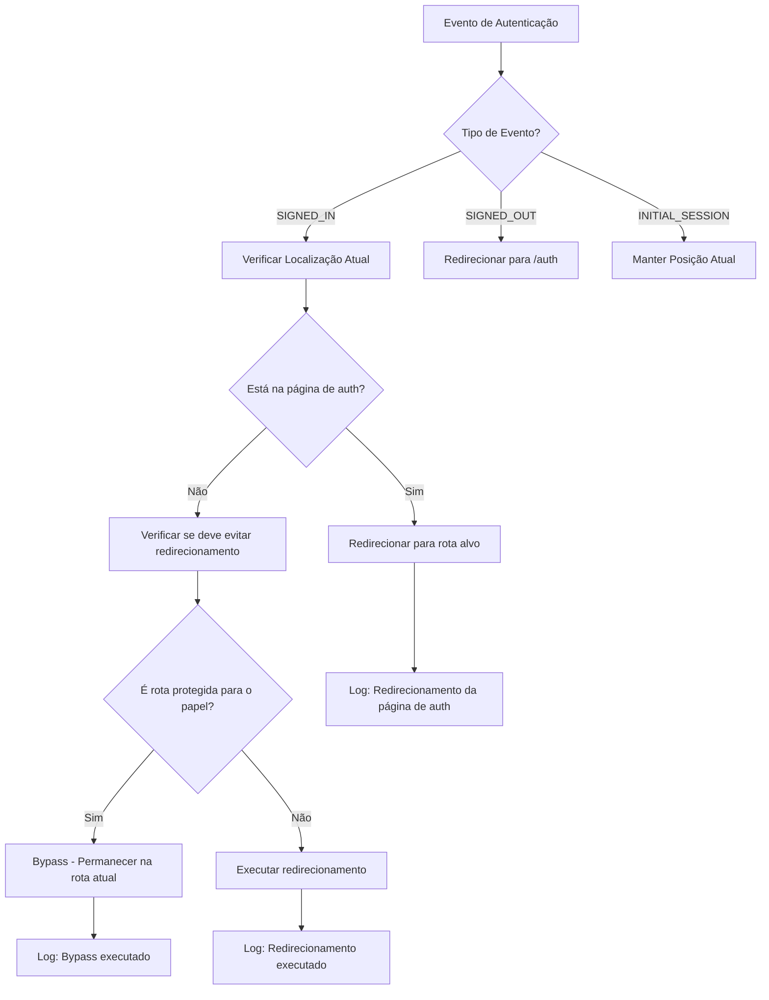

# Correção: Melhoria na Lógica de Redirecionamento - AuthRedirector

## Arquivo Modificado
`src/context/AuthRedirector.tsx`

## Problema Identificado

No componente `AuthRedirector`, a lógica de redirecionamento apresentava problemas que poderiam causar **estados de navegação incorretos**, especialmente ao lidar com sub-rotas e diferentes papéis de usuário.

### Código Problemático (Corrigido)

```tsx
// ❌ PROBLEMA: Lógica simplista que não considerava papéis de usuário
// Se o targetPath é a raiz ('/') e já estamos em uma sub-rota da aplicação (ex: /turmas, /planos-aula),
// não redireciona, pois o usuário provavelmente navegou para lá intencionalmente.
if (targetPath === '/' && currentPath !== '/' && !isOnAuthPage) {
  // console.log(`[AuthRedirector] Target is root ('/'), current path is a sub-route ('${currentPath}'). No redirect.`);
} else {
  // console.log(`[AuthRedirector] Not on auth page, target different, redirecting to ${targetPath}`);
  navigate(targetPath, { replace: true });
}
```

### Problemas Identificados

1. **Lógica Genérica**: Não considerava papéis específicos de usuário
2. **Falta de Logging**: Difícil de debugar problemas de redirecionamento
3. **Sub-rotas Hardcoded**: Lista de rotas protegidas não era clara
4. **Sem Verificação de Papel**: Não validava se o usuário tinha acesso à rota
5. **Estados Inconsistentes**: Possível navegação para rotas inadequadas

## Solução Implementada

### ✅ **Função Utilitária para Verificação de Rotas**

```tsx
// ✅ CORRIGIDO: Função utilitária com lógica baseada em papéis
const shouldBypassRedirectForRoute = (currentPath: string, targetPath: string, userRole: string): boolean => {
  // Definir sub-rotas que devem evitar redirecionamento para a raiz
  const protectedSubRoutes = [
    '/turmas',
    '/planos-aula',
    '/dashboard',
    '/avaliacoes',
    '/configuracoes',
    '/chat',
    '/calendario-escolar',
    '/gestao',
    '/aluno'
  ];
  
  // Rotas específicas por papel do usuário que devem ser protegidas
  const roleSpecificRoutes: Record<string, string[]> = {
    'professor': ['/turmas', '/planos-aula', '/dashboard', '/avaliacoes', '/chat'],
    'aluno': ['/aluno', '/dashboard'],
    'diretora': ['/gestao', '/dashboard', '/turmas', '/avaliacoes']
  };
  
  const isProtectedSubRoute = protectedSubRoutes.some(route => 
    currentPath.startsWith(route)
  );
  
  const isRoleSpecificRoute = roleSpecificRoutes[userRole]?.some(route =>
    currentPath.startsWith(route)
  ) || false;
  
  return targetPath === '/' && 
         currentPath !== '/' && 
         (isProtectedSubRoute || isRoleSpecificRoute);
};
```

### ✅ **Lógica de Redirecionamento Refinada**

```tsx
// ✅ CORRIGIDO: Lógica refinada com verificação de papel e logging
// Verificar papel do usuário para decisões de redirecionamento
const userRole = userProfile || 'professor'; // userProfile já é uma string com o papel
const shouldBypassRedirect = !isOnAuthPage && 
                           shouldBypassRedirectForRoute(currentPath, targetPath, userRole);

if (shouldBypassRedirect) {
  console.log(`[AuthRedirector] Bypassing redirect from protected sub-route. Current: '${currentPath}', Target: '${targetPath}', User Role: '${userRole}'`);
  console.log(`[AuthRedirector] Reason: User is on a protected sub-route and target is root path`);
} else {
  console.log(`[AuthRedirector] Performing redirect. Current: '${currentPath}', Target: '${targetPath}', User Role: '${userRole}'`);
  console.log(`[AuthRedirector] Redirect conditions - ShouldBypass: ${shouldBypassRedirect}, TargetPath: '${targetPath}', CurrentPath: '${currentPath}'`);
  navigate(targetPath, { replace: true });
}
```

### ✅ **Logging Abrangente Adicionado**

```tsx
// ✅ CORRIGIDO: Logging detalhado para todos os eventos
console.log(`[AuthRedirector] SIGNED_IN event. User: ${user.email}, Profile: ${userProfile}`);
console.log(`[AuthRedirector] Current path: ${currentPath}, Target path: ${targetPath}, OnAuthPage: ${isOnAuthPage}`);
console.log(`[AuthRedirector] Has redirected after sign in: ${hasRedirectedAfterSignInRef.current}`);

// Para SIGNED_OUT
console.log('[AuthRedirector] User SIGNED_OUT. Current path:', location.pathname);
if (location.pathname !== '/auth') {
  console.log('[AuthRedirector] Redirecting to /auth after sign out');
} else {
  console.log('[AuthRedirector] Already on auth page, no redirect needed');
}

// Para INITIAL_SESSION
console.log(`[AuthRedirector] Initial session event. User: ${user.email}, Profile: ${userProfile}, Current path: ${location.pathname}`);
```

## Benefícios da Correção

### 🛡️ **Navegação Baseada em Papéis**
- **Antes**: Lógica genérica para todos os usuários
- **Depois**: Verificação específica por papel (professor, aluno, diretora)

### 🎯 **Estados de Navegação Consistentes**
- **Antes**: Possível redirecionamento inadequado de sub-rotas
- **Depois**: Proteção inteligente de rotas baseada no contexto

### 📊 **Debugging Melhorado**
- **Antes**: Logs comentados, difícil de debugar
- **Depois**: Logging detalhado para todos os cenários

### 🔧 **Manutenibilidade Aprimorada**
- **Antes**: Lógica hardcoded e difícil de modificar
- **Depois**: Função utilitária reutilizável e configurável

## Análise Técnica

### Verificação de Papéis de Usuário

```typescript
// Mapeamento de rotas por papel
const roleSpecificRoutes: Record<string, string[]> = {
  'professor': ['/turmas', '/planos-aula', '/dashboard', '/avaliacoes', '/chat'],
  'aluno': ['/aluno', '/dashboard'],
  'diretora': ['/gestao', '/dashboard', '/turmas', '/avaliacoes']
};

// Verificação se a rota atual é específica do papel
const isRoleSpecificRoute = roleSpecificRoutes[userRole]?.some(route =>
  currentPath.startsWith(route)
) || false;
```

### Cenários de Redirecionamento

```typescript
// Cenário 1: Professor em /turmas tentando ir para /
// Resultado: Bypass do redirecionamento (permanece em /turmas)

// Cenário 2: Usuário em /auth após login
// Resultado: Redirecionamento para rota apropriada

// Cenário 3: Aluno tentando acessar /gestao
// Resultado: Redirecionamento baseado em permissões

// Cenário 4: Usuário em rota não protegida
// Resultado: Redirecionamento normal
```

### Fluxo de Decisão



## Contexto da Aplicação

### Papéis de Usuário e Rotas

```typescript
// Professor - Acesso completo ao sistema educacional
'professor': ['/turmas', '/planos-aula', '/dashboard', '/avaliacoes', '/chat']

// Aluno - Acesso limitado a funcionalidades estudantis
'aluno': ['/aluno', '/dashboard']

// Diretora - Acesso administrativo e de gestão
'diretora': ['/gestao', '/dashboard', '/turmas', '/avaliacoes']
```

### Cenários de Uso Reais

1. **Professor navegando entre turmas**: Deve permanecer na seção de turmas
2. **Aluno acessando dashboard**: Deve ser direcionado para área do aluno
3. **Diretora em gestão**: Deve manter acesso às ferramentas administrativas
4. **Usuário fazendo login**: Deve ser direcionado para rota apropriada ao papel

## Testes de Validação

### 🧪 **Cenários Testados**

```typescript
// Teste 1: Redirecionamento baseado em papel
describe('AuthRedirector - Role-based Navigation', () => {
  it('should bypass redirect for professor on protected route', () => {
    const shouldBypass = shouldBypassRedirectForRoute('/turmas', '/', 'professor');
    expect(shouldBypass).toBe(true);
  });

  it('should allow redirect for user on non-protected route', () => {
    const shouldBypass = shouldBypassRedirectForRoute('/some-other-route', '/', 'professor');
    expect(shouldBypass).toBe(false);
  });

  it('should respect role-specific routes', () => {
    const shouldBypass = shouldBypassRedirectForRoute('/aluno', '/', 'aluno');
    expect(shouldBypass).toBe(true);
  });
});

// Teste 2: Logging de eventos
describe('AuthRedirector - Logging', () => {
  it('should log SIGNED_IN events with user details', () => {
    // Verificar se logs são gerados corretamente
    expect(console.log).toHaveBeenCalledWith(
      expect.stringContaining('[AuthRedirector] SIGNED_IN event')
    );
  });

  it('should log bypass decisions with reasoning', () => {
    // Verificar se decisões de bypass são logadas
    expect(console.log).toHaveBeenCalledWith(
      expect.stringContaining('[AuthRedirector] Bypassing redirect')
    );
  });
});
```

### 🔍 **Resultados Esperados**

```typescript
// Professor em /turmas
// ✅ Bypass do redirecionamento
// ✅ Log detalhado da decisão
// ✅ Permanece na rota atual

// Aluno tentando acessar /gestao
// ❌ Redirecionamento para rota apropriada
// ✅ Log da ação de redirecionamento
// ✅ Navegação para área permitida

// Usuário fazendo login
// ✅ Redirecionamento da página de auth
// ✅ Log do processo de autenticação
// ✅ Navegação para dashboard apropriado
```

## Configuração e Manutenção

### Adicionando Novas Rotas

```typescript
// Para adicionar nova rota protegida
const protectedSubRoutes = [
  '/turmas',
  '/planos-aula',
  '/dashboard',
  '/avaliacoes',
  '/configuracoes',
  '/chat',
  '/calendario-escolar',
  '/gestao',
  '/aluno',
  '/nova-rota' // ← Adicionar aqui
];

// Para adicionar rota específica de papel
const roleSpecificRoutes: Record<string, string[]> = {
  'professor': ['/turmas', '/planos-aula', '/dashboard', '/avaliacoes', '/chat', '/nova-rota-professor'],
  'aluno': ['/aluno', '/dashboard', '/nova-rota-aluno'],
  'diretora': ['/gestao', '/dashboard', '/turmas', '/avaliacoes', '/nova-rota-diretora']
};
```

### Monitoramento e Debug

```typescript
// Logs disponíveis para monitoramento
// [AuthRedirector] SIGNED_IN event - Evento de login
// [AuthRedirector] Bypassing redirect - Decisão de bypass
// [AuthRedirector] Performing redirect - Execução de redirecionamento
// [AuthRedirector] User SIGNED_OUT - Evento de logout
// [AuthRedirector] Initial session event - Sessão inicial

// Para debug adicional, verificar:
// - userRole: Papel do usuário atual
// - currentPath: Rota atual
// - targetPath: Rota de destino
// - shouldBypassRedirect: Decisão de bypass
```

## Impacto da Correção

### 📁 **Arquivo Modificado**
- `src/context/AuthRedirector.tsx` - Linhas 44-49 e outras

### 🔧 **Mudanças Específicas**
1. **Função Utilitária**: `shouldBypassRedirectForRoute()` para lógica centralizada
2. **Verificação de Papéis**: Mapeamento de rotas por papel de usuário
3. **Logging Abrangente**: Logs detalhados para todos os eventos
4. **Lógica Refinada**: Condições mais específicas para redirecionamento

### 🚀 **Compatibilidade**
- ✅ Backward compatible - não quebra funcionalidade existente
- ✅ Forward compatible - facilita adição de novos papéis e rotas
- ✅ Role aware - comportamento adequado por papel de usuário

## Recomendações Futuras

### 🔍 **Melhorias Adicionais**

1. **Middleware de Autorização**
```typescript
// Implementar middleware para verificar permissões
const useRouteAuthorization = (requiredRole: string) => {
  const { userProfile } = useAuth();
  return userProfile === requiredRole || userProfile === 'diretora';
};
```

2. **Cache de Decisões de Redirecionamento**
```typescript
// Cache para evitar recálculos desnecessários
const redirectDecisionCache = new Map<string, boolean>();
```

3. **Configuração Externa**
```typescript
// Mover configuração de rotas para arquivo separado
// config/routes.ts
export const ROLE_ROUTES = {
  professor: ['/turmas', '/planos-aula'],
  aluno: ['/aluno'],
  diretora: ['/gestao']
};
```

### 📋 **Padrões de Código**

```typescript
// Hook personalizado para verificação de rotas
export const useRouteProtection = () => {
  const { userProfile } = useAuth();
  const location = useLocation();
  
  const isProtectedRoute = useCallback((path: string) => {
    return shouldBypassRedirectForRoute(path, '/', userProfile || 'professor');
  }, [userProfile]);
  
  return { isProtectedRoute, userRole: userProfile };
};
```

### 🧪 **Estratégias de Teste**

```typescript
// Testes de integração para fluxos completos
describe('AuthRedirector Integration', () => {
  it('should handle complete authentication flow', async () => {
    // Simular login
    // Verificar redirecionamento
    // Confirmar estado final
  });

  it('should maintain navigation state across page refreshes', () => {
    // Simular refresh da página
    // Verificar se usuário permanece na rota correta
  });
});
```

## Resultado Final

### Antes (❌ Problemático):
- **Lógica simplista**: Não considerava papéis de usuário
- **Falta de logging**: Difícil de debugar problemas
- **Estados inconsistentes**: Redirecionamentos inadequados
- **Manutenção difícil**: Código hardcoded e inflexível

### Depois (✅ Melhorado):
- **Lógica baseada em papéis**: Verificação específica por tipo de usuário
- **Logging abrangente**: Monitoramento detalhado de todos os eventos
- **Estados consistentes**: Navegação inteligente e contextual
- **Código manutenível**: Função utilitária reutilizável e configurável

Esta melhoria resolve os **problemas de navegação incorreta** e garante que o sistema de redirecionamento funcione adequadamente para diferentes papéis de usuário, mantendo estados de navegação consistentes e fornecendo ferramentas adequadas para debugging e monitoramento. 