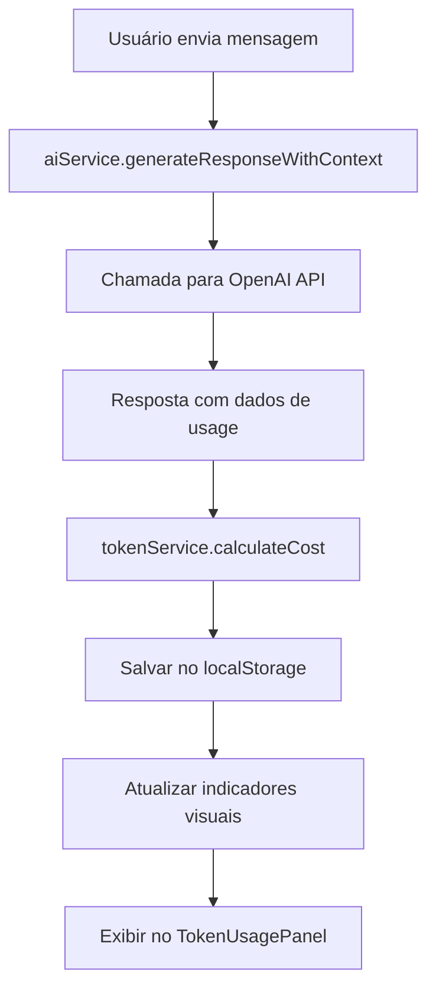

# Sistema de Monitoramento de Tokens e Custos OpenAI

## 📊 Visão Geral

Este sistema implementa um monitoramento completo e em tempo real do uso de tokens e custos da OpenAI no chat do sistema educacional. Baseado na documentação oficial da OpenAI e nas melhores práticas de gerenciamento de contexto de conversas.

## 🎯 Funcionalidades Principais

### 1. **Monitoramento em Tempo Real**
- Captura automática de dados reais de uso de tokens da API OpenAI
- Cálculo preciso de custos baseado nos preços oficiais
- Exibição de custos em USD e BRL (com taxa de câmbio)
- Indicador visual de custo da sessão atual

### 2. **Análise Detalhada**
- Breakdown completo: tokens de entrada vs. saída
- Histórico de uso por dia/semana/mês
- Identificação das chamadas mais caras
- Relatórios de uso por professor

### 3. **Otimização de Custos**
- Suporte a tokens em cache (75% de desconto)
- Estimativa de tokens antes do envio
- Alertas de uso excessivo
- Sugestões de otimização

## 🏗️ Arquitetura do Sistema

### Componentes Principais

```
src/services/tokenService.ts     # Serviço principal de monitoramento
src/services/aiService.ts        # Integração com OpenAI (atualizado)
src/components/TokenUsagePanel.tsx # Interface de monitoramento
src/pages/Chat.tsx              # Chat com indicadores de custo
```

### Fluxo de Dados



## 💰 Preços e Modelos Suportados

### GPT-4o-mini (Modelo Principal)
- **Entrada:** $0.15 por 1M tokens
- **Saída:** $0.60 por 1M tokens  
- **Cache (75% desconto):** $0.0375 por 1M tokens

### Outros Modelos
- **GPT-4o:** $2.50 entrada / $10.00 saída
- **GPT-4-turbo:** $10.00 entrada / $30.00 saída
- **GPT-3.5-turbo:** $0.50 entrada / $1.50 saída

## 🔧 Implementação Técnica

### 1. Captura de Dados Reais

```typescript
// No aiService.ts - captura dados da resposta da OpenAI
if (data.usage) {
  const cost = tokenService.calculateCost(
    data.usage.prompt_tokens,
    data.usage.completion_tokens,
    model
  );

  usage = {
    prompt_tokens: data.usage.prompt_tokens,
    completion_tokens: data.usage.completion_tokens,
    total_tokens: data.usage.total_tokens,
    estimated_cost: cost,
    model,
    timestamp: new Date()
  };
}
```

### 🔍 Diferença entre Tokenizer e API Real

**Por que os tokens de entrada são diferentes do tokenizer da OpenAI?**

#### Tokenizer Isolado (site da OpenAI):
- Conta apenas o texto que você digita
- Exemplo: "Como criar um plano de aula?" = ~8 tokens

#### API Real (nosso sistema):
- **Prompt do Sistema**: ~500-1000 tokens (instruções da persona)
- **Histórico da Conversa**: Todas as mensagens anteriores
- **Mensagem Atual**: Sua pergunta/texto
- **Total**: Pode ser 10x maior que o texto isolado

#### Exemplo Prático:
```
Sua mensagem: "Como criar um plano de aula?" (8 tokens)

API Real envia:
├── Prompt Sistema: 800 tokens (persona + contexto)
├── Histórico: 200 tokens (3 mensagens anteriores)  
└── Mensagem Atual: 8 tokens
Total Entrada: 1.008 tokens ✅

Tokenizer isolado: 8 tokens ❌ (não inclui contexto)
```

**✅ Nossos dados são precisos!** Usamos os valores reais da API OpenAI.

### 2. Estimativa de Tokens

```typescript
// Regra aproximada para português/inglês
estimateTokens(text: string): number {
  const charCount = text.length;
  const wordCount = text.split(/\s+/).length;
  
  // 1 token ≈ 4 caracteres ou 0.75 palavras
  const tokensByChars = Math.ceil(charCount / 4);
  const tokensByWords = Math.ceil(wordCount / 0.75);
  
  return Math.max(tokensByChars, tokensByWords);
}
```

### 3. Cálculo de Custos

```typescript
calculateCost(
  inputTokens: number, 
  outputTokens: number, 
  model: string = 'gpt-4o-mini',
  cachedInputTokens: number = 0
): number {
  const pricing = MODEL_PRICING[model];
  const freshInputTokens = inputTokens - cachedInputTokens;
  
  const inputCost = (freshInputTokens / 1000) * pricing.input_per_1k;
  const cachedCost = (cachedInputTokens / 1000) * pricing.cached_input_per_1k;
  const outputCost = (outputTokens / 1000) * pricing.output_per_1k;
  
  return inputCost + cachedCost + outputCost;
}
```

## 📱 Interface do Usuário

### 1. **Indicadores em Tempo Real**
- Badge de custo da sessão atual na interface do chat
- Atualização automática a cada resposta da IA
- Cores visuais para diferentes níveis de gasto

### 2. **Painel de Monitoramento Completo**
- Acesso via botão de gráfico (BarChart3) no chat
- Estatísticas da sessão atual vs. histórico total
- Gráfico de barras dos últimos 7 dias
- Tabela detalhada de cada chamada da sessão

### 3. **Informações Contextuais**
- Preços atuais dos modelos
- Taxa de câmbio USD/BRL
- Dicas de otimização de custos

## 🎛️ Configurações e Personalização

### Modelos de Preços
```typescript
export const MODEL_PRICING: Record<string, TokenPricing> = {
  'gpt-4o-mini': {
    input_per_1k: 0.00015,   // $0.15 por 1M tokens
    output_per_1k: 0.0006,   // $0.60 por 1M tokens
    cached_input_per_1k: 0.0000375 // 75% desconto
  }
  // ... outros modelos
};
```

### Persistência de Dados
- Armazenamento no localStorage por professor
- Limpeza automática de dados antigos (>30 dias)
- Limite de 1000 registros por professor

## 🚀 Otimizações Implementadas

### 1. **Gerenciamento de Contexto**
- Envio do histórico completo da conversa para manter contexto
- Uso eficiente de tokens através de formatação otimizada
- Suporte a cache de prompts do sistema

### 2. **Estimativas Precisas**
- Cálculo baseado em caracteres E palavras
- Uso da estimativa mais conservadora (maior)
- Validação com dados reais da API

### 3. **Performance**
- Cálculos assíncronos para não bloquear a UI
- Debounce em atualizações de estatísticas
- Lazy loading do painel de monitoramento

## 📈 Métricas e Relatórios

### Dados Coletados
- **Por Chamada:** tokens entrada/saída, custo, modelo, timestamp
- **Por Sessão:** total de tokens, custo acumulado, número de mensagens
- **Por Professor:** histórico completo, tendências, gastos totais

### Relatórios Disponíveis
- **Resumo da Sessão:** estatísticas da conversa atual
- **Histórico Total:** todos os dados do professor
- **Tendências:** gráfico dos últimos 7 dias
- **Detalhamento:** tabela de cada chamada individual

## 🔒 Segurança e Privacidade

### Dados Armazenados
- Apenas metadados de uso (tokens, custos, timestamps)
- **NÃO** armazena conteúdo das mensagens
- Dados ficam apenas no localStorage do usuário

### Limpeza Automática
- Remoção de dados > 30 dias
- Limite máximo de 1000 registros
- Opção manual de limpeza

## 🛠️ Manutenção e Atualizações

### Atualização de Preços
1. Editar `MODEL_PRICING` em `tokenService.ts`
2. Atualizar documentação de preços no `TokenUsagePanel`
3. Testar cálculos com novos valores

### Adição de Novos Modelos
1. Adicionar entrada em `MODEL_PRICING`
2. Atualizar interface de seleção se necessário
3. Testar integração com aiService

## 📊 Exemplos de Uso

### Cenário 1: Professor Criando Plano de Aula
```
Entrada: 2,500 tokens (contexto + prompt)
Saída: 800 tokens (plano detalhado)
Custo: $0.00085 USD (~R$ 0,0047)
```

### Cenário 2: Sessão de Chat Longa (10 mensagens)
```
Total Entrada: 15,000 tokens
Total Saída: 6,000 tokens
Custo Total: $0.0061 USD (~R$ 0,034)
```

### Cenário 3: Uso Mensal Típico
```
Chamadas: ~200 por mês
Tokens: ~500,000 total
Custo: ~$1.50 USD (~R$ 8,25)
```

## 🎯 Próximos Passos

### Melhorias Planejadas
1. **Integração com tiktoken** para contagem precisa de tokens
2. **Alertas de orçamento** configuráveis por professor
3. **Exportação de relatórios** em PDF/Excel
4. **Dashboard administrativo** para gestão de custos
5. **Previsão de gastos** baseada em uso histórico

### Otimizações Futuras
1. **Compressão de contexto** para conversas longas
2. **Cache inteligente** de prompts frequentes
3. **Balanceamento de modelos** baseado em complexidade
4. **Batch processing** para reduzir custos

---

## 📞 Suporte

Para dúvidas sobre o sistema de monitoramento:
1. Consulte os logs do console (dados detalhados de cada chamada)
2. Use o painel de monitoramento para análise visual
3. Verifique a documentação da OpenAI para preços atualizados

**Lembre-se:** O sistema usa estimativas conservadoras. Os valores reais podem ser ligeiramente diferentes devido a variações na tokenização. 