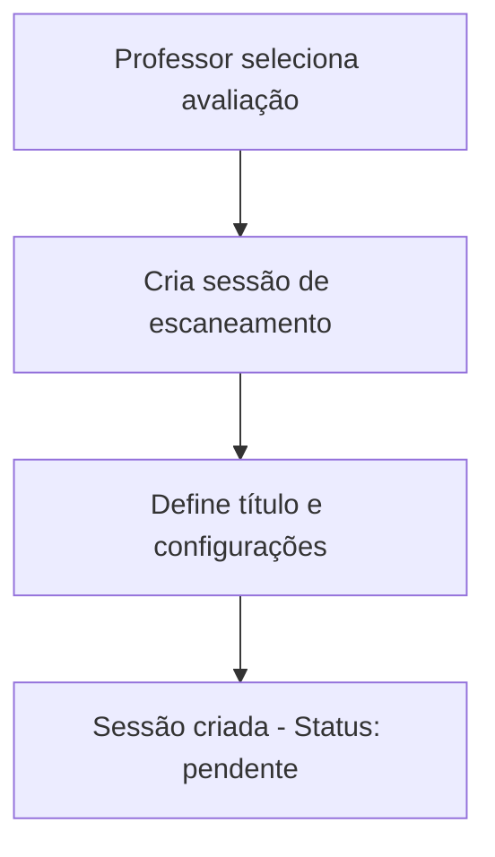
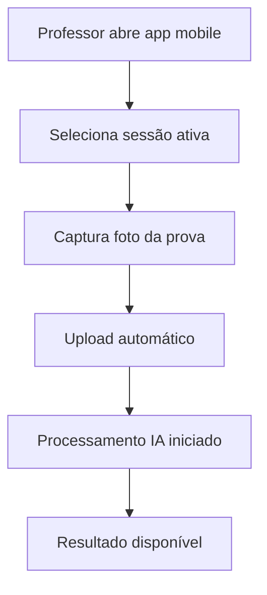
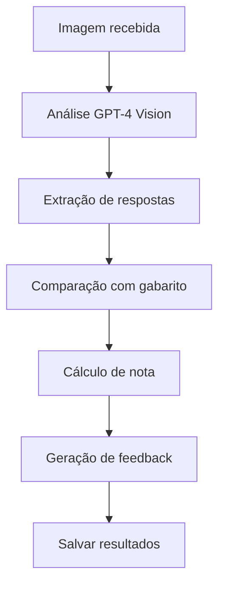

# 📱 Sistema de Correção Automática de Provas - ExProfessor

## 🎯 Visão Geral

O Sistema de Correção Automática de Provas permite que professores escaneiem avaliações impressas através de seus dispositivos móveis e obtenham correções automáticas utilizando Inteligência Artificial. O sistema foi projetado para funcionar principalmente em dispositivos móveis, oferecendo uma solução completa para digitalização e correção de provas.

## 🏗️ Arquitetura do Sistema

### 📊 Estrutura do Banco de Dados

#### 1. **Tabela: `sessoes_escaneamento`**
Gerencia as sessões de correção iniciadas pelos professores.

```sql
- id (UUID) - Identificador único da sessão
- professor_id (INTEGER) - Referência ao professor
- avaliacao_original_id (UUID) - Referência à avaliação base
- escola_id, turma_id, disciplina_id - Contexto educacional
- titulo, descricao - Informações da sessão
- status (ENUM) - pendente, processando, corrigida, erro, revisao_necessaria
- configuracoes_ia (JSONB) - Configurações de IA
- estatísticas de progresso (contadores)
```

#### 2. **Tabela: `avaliacoes_escaneadas`**
Armazena cada prova individual escaneada e processada.

```sql
- id (UUID) - Identificador único
- sessao_escaneamento_id (UUID) - Referência à sessão
- imagem_url (TEXT) - URL da imagem no storage
- dados de identificação do aluno
- resultados da correção automática
- feedback e análises da IA
- controle de qualidade e revisão
```

#### 3. **Tabela: `questoes_corrigidas_detalhes`**
Detalhes da correção de cada questão individual.

```sql
- avaliacao_escaneada_id (UUID) - Referência à avaliação
- numero_questao, tipo_questao
- resposta_aluno, resposta_esperada
- pontuação e justificativas
- feedback específico da questão
```

#### 4. **Tabela: `logs_processamento_ia`**
Logs completos para auditoria e debug.

```sql
- registros de todas as operações
- tempos de execução
- custos estimados
- dados técnicos do processamento
```

### 🔧 Edge Functions (Supabase)

#### 1. **`correcao-automatica-provas`**
**Função:** Processa a correção automática usando IA
**Entrada:** 
- `avaliacaoEscaneadaId`: ID da avaliação escaneada
- `imagemUrl`: URL da imagem da prova
- `avaliacaoOriginalId`: ID da avaliação original
- `configuracoes`: Configurações opcionais

**Processo:**
1. Busca dados da avaliação original
2. Cria prompt especializado para correção
3. Chama GPT-4 Vision para análise da imagem
4. Processa resposta da IA
5. Salva resultados no banco
6. Registra logs de auditoria

**Saída:**
```json
{
  "success": true,
  "resultado": {
    "notaFinal": 8.5,
    "percentualAcerto": 85.0,
    "questoesCorrigidas": [...],
    "feedbackGeral": "...",
    "necessitaRevisao": false
  }
}
```

#### 2. **`upload-prova-mobile`**
**Função:** Recebe upload de imagens via mobile
**Entrada:**
- `sessaoId`: ID da sessão de escaneamento
- `imagemBase64`: Imagem em base64
- `processarImediatamente`: Boolean para processamento automático

**Processo:**
1. Valida sessão de escaneamento
2. Converte base64 para buffer
3. Faz upload para Supabase Storage
4. Registra avaliação escaneada no banco
5. Opcionalmente inicia correção automática
6. Retorna estatísticas atualizadas

#### 3. **`gestao-sessoes-correcao`**
**Função:** API completa para gerenciar sessões
**Endpoints:**
- `GET ?action=listar` - Lista sessões do professor
- `GET ?action=detalhes&sessaoId=X` - Detalhes de uma sessão
- `GET ?action=estatisticas&sessaoId=X` - Estatísticas da sessão
- `GET ?action=avaliacoes-disponiveis` - Avaliações disponíveis
- `POST /criar` - Criar nova sessão
- `POST /finalizar` - Finalizar sessão

### 🗄️ Storage

#### Bucket: `avaliacoes-escaneadas`
- **Estrutura:** `provas-escaneadas/{sessaoId}/{timestamp}_{nomeArquivo}`
- **Tipos permitidos:** JPG, PNG, WebP, PDF
- **Limite:** 50MB por arquivo
- **Políticas RLS:** Apenas professores autenticados

## 🔄 Fluxo de Funcionamento

### 1. **Criação de Sessão**


### 2. **Escaneamento via Mobile**


### 3. **Processamento IA**


## 🎯 Funcionalidades Principais

### ✅ **Para Professores**
1. **Criação de Sessões**
   - Selecionar avaliação base
   - Configurar parâmetros de correção
   - Definir número esperado de provas

2. **Escaneamento Mobile**
   - Interface otimizada para celular
   - Captura de múltiplas provas
   - Upload automático com feedback

3. **Correção Automática**
   - Análise inteligente de respostas
   - Identificação automática de alunos
   - Cálculo de notas e percentuais

4. **Feedback Educativo**
   - Análise detalhada por questão
   - Identificação de pontos fortes
   - Sugestões de melhoria
   - Recomendações de estudo

5. **Controle de Qualidade**
   - Sistema de confiança da IA
   - Marcação para revisão manual
   - Logs completos de auditoria

### 📊 **Relatórios e Estatísticas**
- Progresso da sessão em tempo real
- Estatísticas de desempenho da turma
- Análise de questões mais difíceis
- Relatórios de tempo de processamento

## 🔒 Segurança e Privacidade

### **Row Level Security (RLS)**
- Professores só acessam suas próprias sessões
- Isolamento completo entre escolas
- Políticas de acesso granulares

### **Auditoria Completa**
- Log de todas as operações
- Rastreamento de custos de IA
- Histórico de processamento
- Backup automático de dados

## 📱 Interface Mobile

### **Características Principais**
1. **Design Responsivo**
   - Otimizado para smartphones
   - Interface intuitiva
   - Feedback visual em tempo real

2. **Funcionalidades Offline**
   - Cache de sessões ativas
   - Queue de upload quando conectar
   - Sincronização automática

3. **Captura Otimizada**
   - Detecção automática de bordas
   - Correção de perspectiva
   - Compressão inteligente

## 🚀 Implementação no Frontend

### **Páginas Necessárias**

#### 1. **Lista de Sessões** (`/correcao-automatica`)
```typescript
interface SessaoCorrecao {
  id: string;
  titulo: string;
  status: 'pendente' | 'processando' | 'corrigida';
  avaliacaoTitulo: string;
  turmaNome: string;
  totalEsperadas: number;
  totalCorrigidas: number;
  percentualConclusao: number;
}
```

#### 2. **Criar Nova Sessão** (`/correcao-automatica/nova`)
```typescript
interface CriarSessaoForm {
  avaliacaoOriginalId: string;
  titulo: string;
  descricao?: string;
  totalProvasEsperadas: number;
}
```

#### 3. **Detalhes da Sessão** (`/correcao-automatica/[id]`)
```typescript
interface DetalheSessao {
  sessao: SessaoCorrecao;
  avaliacoesEscaneadas: AvaliacaoEscaneada[];
  estatisticas: EstatisticasSessao;
}
```

#### 4. **Scanner Mobile** (`/correcao-automatica/[id]/scanner`)
```typescript
interface ScannerMobile {
  sessaoId: string;
  camera: CameraComponent;
  uploadQueue: UploadQueue;
  progressIndicator: ProgressComponent;
}
```

### **Componentes Reutilizáveis**

#### 1. **CameraScanner**
```typescript
interface CameraScannerProps {
  onCapture: (imageBase64: string) => void;
  onError: (error: string) => void;
  autoUpload?: boolean;
}
```

#### 2. **ProgressIndicator**
```typescript
interface ProgressIndicatorProps {
  total: number;
  completed: number;
  processing: number;
  errors: number;
}
```

#### 3. **ResultadoCorrecao**
```typescript
interface ResultadoCorrecaoProps {
  avaliacao: AvaliacaoEscaneada;
  showDetails?: boolean;
  allowEdit?: boolean;
}
```

## 🔧 Configuração e Deploy

### **Variáveis de Ambiente Necessárias**
```env
OPENAI_API_KEY=sk-...
SUPABASE_URL=https://...
SUPABASE_SERVICE_ROLE_KEY=...
```

### **Permissões Storage**
```sql
-- Já configuradas nas migrações
-- Bucket: avaliacoes-escaneadas
-- Políticas RLS ativas
```

### **Edge Functions Deployadas**
1. ✅ `correcao-automatica-provas`
2. ✅ `upload-prova-mobile`
3. ✅ `gestao-sessoes-correcao`

## 📈 Próximos Passos

### **Fase 1: Interface Web** (Atual)
- [ ] Criar páginas de gestão de sessões
- [ ] Implementar interface de scanner mobile
- [ ] Desenvolver dashboards de resultados

### **Fase 2: Melhorias IA**
- [ ] Suporte a múltiplos modelos de IA
- [ ] Treinamento específico para tipos de prova
- [ ] Reconhecimento de caligrafia melhorado

### **Fase 3: Analytics Avançados**
- [ ] Relatórios de desempenho da turma
- [ ] Análise de tendências de aprendizado
- [ ] Sugestões pedagógicas automáticas

### **Fase 4: Integração Mobile**
- [ ] App nativo React Native
- [ ] Funcionalidades offline
- [ ] Sincronização em background

## 🎯 Benefícios do Sistema

### **Para Professores**
- ⏱️ **Economia de Tempo:** Correção automática em minutos
- 📊 **Análises Detalhadas:** Feedback rico e personalizado
- 📱 **Mobilidade:** Correção em qualquer lugar
- 🎯 **Precisão:** IA especializada em educação

### **Para Alunos**
- 📝 **Feedback Rápido:** Resultados em tempo real
- 🎯 **Orientação Personalizada:** Sugestões específicas
- 📈 **Acompanhamento:** Histórico de desempenho

### **Para Escolas**
- 💰 **Redução de Custos:** Menos tempo de correção manual
- 📊 **Dados Educacionais:** Analytics de aprendizado
- 🔒 **Segurança:** Dados protegidos e auditáveis

---

## 🛠️ Status da Implementação

### ✅ **Concluído**
- [x] Estrutura completa do banco de dados
- [x] Edge Functions para processamento
- [x] Sistema de storage configurado
- [x] Funções auxiliares SQL
- [x] Políticas de segurança RLS
- [x] Logs e auditoria

### 🔄 **Em Desenvolvimento**
- [ ] Interface web para gestão
- [ ] Componentes de scanner mobile
- [ ] Dashboards de resultados

### 📋 **Próximas Tarefas**
1. Implementar páginas web do sistema
2. Criar componentes de câmera mobile
3. Desenvolver dashboards de análise
4. Testes com provas reais
5. Otimização de performance

---

**Sistema desenvolvido para o projeto ExProfessor**
*Correção automática de provas com IA - Janeiro 2025* 