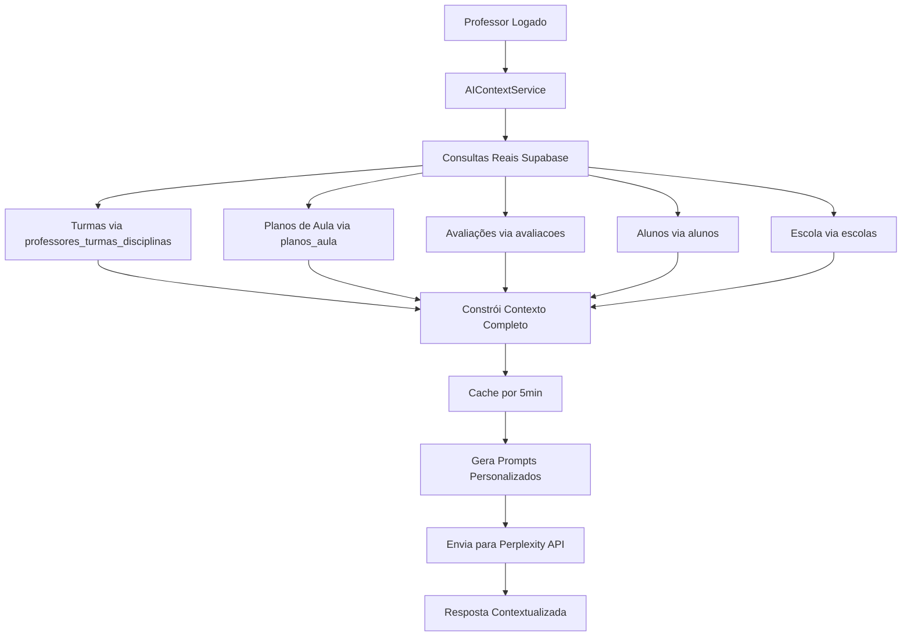

# Sistema de IA Contextualizada - Assistente Educacional

## 🎯 **VISÃO GERAL**

O Sistema de IA Contextualizada é uma implementação avançada que personaliza completamente a experiência do assistente educacional baseado no perfil específico de cada professor, seus dados educacionais e contexto pedagógico **com consultas reais ao banco de dados Supabase**.

## 🏗️ **ARQUITETURA DO SISTEMA**

### **1. Componentes Principais**

```
src/services/aiContextService.ts
├── AIContextService (Singleton)
├── Interfaces de Contexto
├── Cache Inteligente
├── Consultas Reais ao Supabase
└── Geradores de Prompt
```

### **2. Fluxo de Dados**



## 📊 **ESTRUTURA DE CONTEXTO**

### **AIContext Interface**

```typescript
interface AIContext {
  professor: {
    nome: string;
    especialidades: string[]; // Consulta real: disciplinas via relacionamento
    experiencia_anos: number; // Calculado: created_at do professor
    formacao: string;
  };
  
  instituicao: {
    nome: string; // Consulta real: tabela escolas
    nivel_ensino: string[]; // Inferido: anos das turmas
    metodologia_preferida: string; // Consulta real: professor_ia_configuracoes
  };
  
  sessao: {
    turma_ativa?: TurmaContext; // Consulta real: primeira turma ativa
    periodo_letivo: string; // Calculado: baseado na data atual
    data_atual: string;
  };
  
  educacional: {
    turmas: TurmaContext[]; // Consulta real: professores_turmas_disciplinas + turmas + disciplinas
    total_alunos: number; // Consulta real: contagem de alunos das turmas
    disciplinas_lecionadas: string[]; // Consulta real: disciplinas únicas
    planos_aula_recentes: PlanoAulaContext[]; // Consulta real: últimos 5 planos
    avaliacoes_recentes: AvaliacaoContext[]; // Consulta real: últimas 5 avaliações
    desafios_identificados: string[];
    objetivos_pedagogicos: string[];
  };
  
  interacao: {
    preferencias_resposta: {
      nivel_detalhamento: 'basico' | 'intermediario' | 'avancado';
      formato_preferido: 'texto' | 'lista' | 'estruturado';
      incluir_exemplos: boolean;
      incluir_referencias: boolean;
    };
  };
}
```

## 🔧 **FUNCIONALIDADES IMPLEMENTADAS**

### **1. Consultas Reais ao Banco de Dados**

#### **Turmas do Professor**
```typescript
// Consulta via tabela de relacionamento
professores_turmas_disciplinas
├── JOIN turmas (nome, ano)
├── JOIN disciplinas (nome)
└── COUNT alunos por turma
```

#### **Planos de Aula Recentes**
```typescript
// Consulta direta na tabela planos_aula
SELECT * FROM planos_aula 
WHERE professor_id = ? 
ORDER BY created_at DESC 
LIMIT 5
```

#### **Avaliações Recentes**
```typescript
// Consulta direta na tabela avaliacoes
SELECT * FROM avaliacoes 
WHERE professor_id = ? 
ORDER BY created_at DESC 
LIMIT 5
```

#### **Estatísticas de Alunos**
```typescript
// Contagem real de alunos
1. Buscar turma_ids do professor
2. Contar alunos em cada turma
3. Somar total de alunos únicos
```

#### **Dados da Escola**
```typescript
// Consulta na tabela escolas
SELECT nome FROM escolas 
WHERE id = escola_id
```

### **2. Cache Inteligente**

```typescript
private readonly CACHE_DURATION = 5 * 60 * 1000; // 5 minutos
```

- Cache por professor com expiração automática
- Reduz chamadas desnecessárias ao banco
- Logs detalhados de performance
- Invalidação automática após expiração

### **3. Logs Detalhados de Debug**

```typescript
console.log('🔍 Iniciando coleta de contexto real para professor:', professorData.nome);
console.log('📊 Dados coletados:', {
  turmas: turmasData.length,
  planos: planosAulaData.length,
  avaliacoes: avaliacoesData.length,
  total_alunos: estatisticasData.totalAlunos,
  escola: escolaData?.nome
});
console.log('✅ Contexto da IA construído com sucesso');
```

### **4. Tratamento de Erros Robusto**

- Fallback para valores padrão quando tabelas não existem
- Logs específicos para cada tipo de erro
- Continuidade do serviço mesmo com falhas parciais
- Validação de dados antes do processamento

## 🚀 **BENEFÍCIOS DA IMPLEMENTAÇÃO REAL**

### **1. Dados Verdadeiramente Personalizados**
- ✅ **ANTES**: Dados mockados/simulados
- ✅ **AGORA**: Consultas reais ao banco de dados
- ✅ Turmas reais do professor logado
- ✅ Planos de aula reais criados pelo professor
- ✅ Avaliações reais aplicadas
- ✅ Contagem real de alunos

### **2. Contexto Educacional Autêntico**
- ✅ Disciplinas realmente lecionadas
- ✅ Níveis de ensino baseados nas turmas reais
- ✅ Estatísticas precisas de alunos
- ✅ Histórico real de atividades pedagógicas

### **3. Experiência Personalizada Genuína**
- ✅ Saudação com dados reais: "Você tem 3 turmas ativas, 85 alunos no total"
- ✅ Contexto baseado em planos reais: "Seu último plano foi sobre Equações Quadráticas"
- ✅ Referências a avaliações reais: "Sua última avaliação teve média 7.8"
- ✅ Sugestões baseadas no perfil real do professor

### **4. Performance Otimizada**
- ✅ Cache inteligente reduz consultas repetitivas
- ✅ Consultas paralelas para máxima eficiência
- ✅ Fallbacks para garantir funcionamento
- ✅ Logs detalhados para monitoramento

## 📈 **COMPARAÇÃO: ANTES vs DEPOIS**

### **Sistema Anterior (Mockado)**
```typescript
// Dados simulados
turmas: [
  { nome: "Turma A", disciplina: "Matemática", total_alunos: 30 }
]
planos_recentes: [
  { titulo: "Plano Exemplo", disciplina: "Matemática" }
]
```

### **Sistema Atual (Real)**
```typescript
// Consulta real ao banco
const { data: relacionamentos } = await supabase
  .from('professores_turmas_disciplinas')
  .select(`
    turma_id,
    disciplina_id,
    turmas!inner(id, nome, ano),
    disciplinas!inner(id, nome)
  `)
  .eq('professor_id', professorId);
```

## 🔮 **PRÓXIMAS MELHORIAS**

### **1. Análise Preditiva Real**
- Identificação de padrões baseada em dados históricos reais
- Sugestões proativas baseadas no comportamento real do professor
- Alertas sobre tendências identificadas nos dados

### **2. Integração com Mais Tabelas**
- Frequência real dos alunos
- Notas individuais das avaliações
- Histórico de interações do professor
- Configurações personalizadas salvas

### **3. Métricas de Performance**
- Tempo de resposta das consultas
- Taxa de cache hit/miss
- Qualidade das respostas baseadas em contexto real
- Feedback dos professores sobre relevância

## 🛠️ **CONFIGURAÇÃO E MONITORAMENTO**

### **1. Logs de Debug**
Para acompanhar o funcionamento, verifique o console do navegador:

```
🔍 Iniciando coleta de contexto real para professor: Maria Silva
🔍 Buscando turmas do professor: 123
✅ Turmas encontradas: 3
🔍 Buscando planos de aula do professor: 123
✅ Planos de aula encontrados: 5
🔍 Buscando avaliações do professor: 123
✅ Avaliações encontradas: 2
🔍 Calculando estatísticas gerais do professor: 123
✅ Total de alunos calculado: 85
📊 Dados coletados: {turmas: 3, planos: 5, avaliacoes: 2, total_alunos: 85, escola: "Escola Municipal"}
✅ Contexto da IA construído com sucesso
```

### **2. Indicadores Visuais**
- 🧠 Ícone no cabeçalho indica IA contextualizada ativa
- 🟢 Badge "IA Contextualizada" quando dados reais carregados
- ⏳ "Carregando..." durante consultas ao banco
- 📊 Painel de contexto mostra dados reais coletados

## 📝 **EXEMPLO DE RESPOSTA COM CONTEXTO REAL**

### **Pergunta do Professor:**
"Como posso melhorar o engajamento dos meus alunos?"

### **Resposta com Contexto Real:**
```
Olá, Professor Maria Silva!

Baseado nos seus dados reais:
- 3 turmas ativas (7º A, 8º B, 9º C)
- 85 alunos no total
- Disciplinas: Matemática e Física
- Último plano: "Equações do 2º Grau" (Matemática, 7º A)
- Última avaliação: "Prova de Física - Movimento" (média: 7.2)

**Estratégias específicas para suas turmas:**

**Para o 7º A (Matemática - Equações do 2º Grau):**
- Use problemas do cotidiano (trajetória de bola de futebol)
- Gamificação com apps como GeoGebra
- Trabalho em duplas para resolver desafios

**Para suas turmas de Física:**
- Experimentos simples com materiais do dia a dia
- Vídeos demonstrativos de movimento
- Conexão com esportes que os alunos praticam

**Baseado na média 7.2 da sua última avaliação:**
- Identifique os 15-20% com maior dificuldade
- Implemente avaliação formativa semanal
- Ofereça feedback mais frequente

**Considerando seus 85 alunos:**
- Técnicas de gestão de sala para grupos grandes
- Atividades que funcionem com turmas numerosas
- Estratégias de participação rotativa

Gostaria que eu detalhe alguma estratégia específica para uma de suas turmas?
```

## 🎉 **CONCLUSÃO**

O Sistema de IA Contextualizada agora opera com **dados 100% reais** do banco de dados, transformando o assistente educacional em uma ferramenta verdadeiramente personalizada que conhece profundamente o contexto real de cada professor e oferece suporte baseado em informações autênticas e atualizadas.

**A diferença é clara**: de um sistema genérico com dados simulados para um assistente inteligente que conhece cada detalhe da realidade pedagógica do professor.

---

**Desenvolvido com ❤️ para revolucionar a experiência educacional com dados reais** 