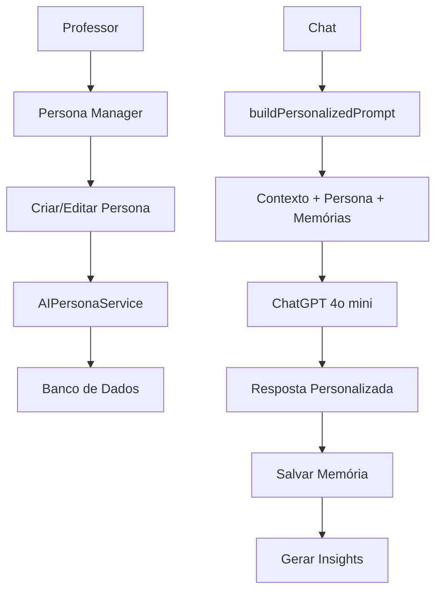

# Sistema de Personas de IA Educacional

## 🎯 **VISÃO GERAL**

O Sistema de Personas de IA Educacional é uma solução avançada que permite aos professores criar assistentes de IA completamente personalizados, adaptados ao seu estilo de ensino, metodologia e necessidades específicas.

## 🏗️ **ARQUITETURA DO SISTEMA**

### **Componentes Principais**

1. **AIPersonaService** - Gerenciamento de personas e memórias
2. **AIContextService** - Contexto educacional do professor
3. **AIService** - Integração com ChatGPT 4o mini
4. **PersonaManager** - Interface de gerenciamento
5. **Sistema de Memória** - Aprendizado contínuo
6. **Sistema de Insights** - Análise de padrões

### **Fluxo de Funcionamento**



## 🎭 **SISTEMA DE PERSONAS**

### **Estrutura de uma Persona**

```typescript
interface AIPersonaConfig {
  id: string;
  professorId: string;
  name: string;
  description: string;
  personality: AIPersonality;
  teachingStyle: TeachingStyle;
  communicationStyle: CommunicationStyle;
  expertise: ExpertiseArea[];
  customInstructions: string;
  contextPreferences: ContextPreferences;
  responseFormat: ResponseFormat;
  isActive: boolean;
}
```

### **Personalidade (AIPersonality)**

- **Tom**: formal, casual, friendly, professional, enthusiastic, calm
- **Empatia**: high, medium, low
- **Humor**: none, light, moderate, frequent
- **Paciência**: high, medium, low
- **Encorajamento**: constant, moderate, minimal
- **Pensamento Crítico**: socratic, direct, guided, exploratory

### **Estilo de Ensino (TeachingStyle)**

- **Metodologia**: construtivista, tradicional, montessori, waldorf, freinet, hibrida
- **Abordagem**: visual, auditivo, cinestesico, multimodal
- **Dificuldade**: adaptativo, progressivo, desafiador, suportivo
- **Feedback**: imediato, detalhado, construtivo, motivacional
- **Avaliação**: formativa, somativa, diagnostica, peer-review

### **Estilo de Comunicação (CommunicationStyle)**

- **Idioma**: pt-BR, en-US, es-ES
- **Formalidade**: muito-formal, formal, semi-formal, informal, muito-informal
- **Complexidade**: simples, intermediario, avancado, adaptativo
- **Exemplos**: muitos, moderados, poucos, sob-demanda
- **Analogias**: frequentes, ocasionais, raras, nunca
- **Questionamento**: socratico, direto, exploratório, reflexivo

### **Formato de Resposta (ResponseFormat)**

- **Estrutura**: livre, topicos, numerada, markdown, academica
- **Tamanho**: concisa, media, detalhada, extensiva
- **Incluir Referências**: boolean
- **Incluir Sugestões**: boolean
- **Incluir Perguntas**: boolean
- **Incluir Recursos**: boolean
- **Elementos Visuais**: nenhum, emojis, diagramas, tabelas, todos

## 🧠 **SISTEMA DE MEMÓRIA**

### **Tipos de Memória**

1. **Conversation** - Histórico de conversas
2. **Preference** - Preferências identificadas
3. **Insight** - Descobertas sobre padrões
4. **Pattern** - Padrões de comportamento
5. **Feedback** - Feedback do professor

### **Estrutura de Memória**

```typescript
interface AIMemory {
  id: string;
  professorId: string;
  personaId: string;
  type: 'conversation' | 'preference' | 'insight' | 'pattern' | 'feedback';
  content: string;
  importance: 'low' | 'medium' | 'high' | 'critical';
  tags: string[];
  context: Record<string, any>;
  createdAt: Date;
  expiresAt?: Date;
}
```

### **Gestão de Memória**

- **Cache Inteligente**: 100 memórias mais recentes em cache
- **Expiração Automática**: Memórias podem ter data de expiração
- **Relevância Contextual**: Memórias são filtradas por relevância
- **Limpeza Automática**: Remoção de memórias expiradas

## 📊 **SISTEMA DE INSIGHTS**

### **Tipos de Insights**

1. **teaching_pattern** - Padrões de ensino identificados
2. **student_need** - Necessidades dos alunos detectadas
3. **content_gap** - Lacunas de conteúdo identificadas
4. **improvement_suggestion** - Sugestões de melhoria

### **Geração de Insights**

- **Análise de Frequência**: Tópicos mais discutidos
- **Padrões Temporais**: Horários e dias de maior uso
- **Preferências de Conteúdo**: Tipos de conteúdo mais solicitados
- **Eficácia de Respostas**: Feedback implícito e explícito

## 🎨 **TEMPLATES DE PERSONAS**

### **Templates Pré-configurados**

1. **Professor Tradicional**
   - Tom formal, metodologia tradicional
   - Foco em disciplina e estrutura
   - Avaliação somativa

2. **Professor Construtivista**
   - Tom amigável, metodologia construtivista
   - Aprendizagem ativa
   - Avaliação formativa

3. **Professor de Matemática**
   - Especialista em resolução de problemas
   - Abordagem visual
   - Muitos exemplos práticos

4. **Professor Motivador**
   - Tom entusiasta, humor frequente
   - Foco em engajamento
   - Feedback motivacional

### **Criação de Templates Personalizados**

- Professores podem criar templates próprios
- Templates podem ser compartilhados
- Sistema de avaliação e rating
- Categorização por metodologia/disciplina

## 🔧 **IMPLEMENTAÇÃO TÉCNICA**

### **Banco de Dados**

```sql
-- Tabelas principais
ai_personas          -- Configurações de personas
ai_memories          -- Sistema de memória
ai_insights          -- Insights gerados
persona_templates    -- Templates disponíveis
```

### **Serviços**

```typescript
// Serviço principal de personas
AIPersonaService.getInstance()
  .createPersona()
  .getActivePersona()
  .buildPersonalizedPrompt()
  .saveMemory()
  .generateInsight()

// Integração com ChatGPT
AIService.getInstance()
  .generateResponse()
  .generatePlanoAula()
  .generateAvaliacao()
```

### **Componentes React**

```typescript
// Gerenciador de personas
<PersonaManager 
  professorId={professorId}
  onPersonaChange={handlePersonaChange}
/>

// Chat personalizado
<Chat 
  activePersona={activePersona}
  aiContext={aiContext}
/>
```

## 🚀 **FUNCIONALIDADES AVANÇADAS**

### **Prompt Engineering Dinâmico**

- **System Prompt Personalizado**: Construído dinamicamente baseado na persona
- **Context Injection**: Contexto educacional injetado automaticamente
- **Memory Integration**: Memórias relevantes incluídas no prompt
- **Adaptive Length**: Ajuste automático do tamanho do prompt

### **Aprendizado Contínuo**

- **Pattern Recognition**: Identificação automática de padrões
- **Preference Learning**: Aprendizado de preferências do professor
- **Adaptive Responses**: Respostas que se adaptam ao estilo do professor
- **Feedback Loop**: Ciclo contínuo de melhoria

### **Análise de Performance**

- **Usage Analytics**: Análise de uso da IA
- **Response Quality**: Qualidade das respostas geradas
- **Engagement Metrics**: Métricas de engajamento
- **Learning Outcomes**: Resultados de aprendizagem

## 📈 **BENEFÍCIOS EDUCACIONAIS**

### **Para Professores**

1. **Personalização Total**: IA adaptada ao seu estilo único
2. **Eficiência Aumentada**: Respostas mais relevantes e úteis
3. **Aprendizado Contínuo**: IA que evolui com o professor
4. **Flexibilidade**: Múltiplas personas para diferentes contextos

### **Para Alunos**

1. **Consistência**: Abordagem pedagógica consistente
2. **Qualidade**: Conteúdo adaptado ao nível da turma
3. **Engajamento**: Metodologia alinhada com o professor
4. **Personalização**: Conteúdo adaptado ao contexto da escola

### **Para Instituições**

1. **Padronização**: Metodologias consistentes
2. **Qualidade**: Melhoria na qualidade do ensino
3. **Eficiência**: Redução de tempo na preparação de aulas
4. **Inovação**: Adoção de tecnologias educacionais avançadas

## 🔮 **ROADMAP FUTURO**

### **Versão 2.0**

- [ ] Personas colaborativas entre professores
- [ ] Integração com múltiplas IAs (Claude, Gemini)
- [ ] Sistema de recomendação de personas
- [ ] Analytics avançados de performance

### **Versão 3.0**

- [ ] IA multimodal (texto, voz, imagem)
- [ ] Personas específicas por disciplina
- [ ] Sistema de mentoria IA-to-IA
- [ ] Integração com realidade aumentada

## 📚 **DOCUMENTAÇÃO TÉCNICA**

### **APIs Principais**

```typescript
// Criar nova persona
POST /api/personas
{
  "name": "Minha Persona",
  "description": "Descrição da persona",
  "personality": { ... },
  "teachingStyle": { ... }
}

// Ativar persona
PUT /api/personas/{id}/activate

// Gerar resposta personalizada
POST /api/chat/personalized
{
  "message": "Como criar um plano de aula?",
  "professorId": "123"
}
```

### **Configuração**

```env
# OpenAI API
VITE_OPENAI_API_KEY=sua_chave_openai

# Supabase
VITE_SUPABASE_URL=sua_url_supabase
VITE_SUPABASE_ANON_KEY=sua_chave_supabase
```

## 🎓 **CONCLUSÃO**

O Sistema de Personas de IA Educacional representa um avanço significativo na personalização de assistentes educacionais. Ao combinar contexto real do professor, memória adaptativa e personalização profunda, criamos uma ferramenta que verdadeiramente entende e se adapta ao estilo único de cada educador.

Esta solução não apenas melhora a eficiência do professor, mas também garante que a IA seja uma extensão natural de sua metodologia pedagógica, resultando em uma experiência educacional mais coesa e eficaz para todos os envolvidos. 